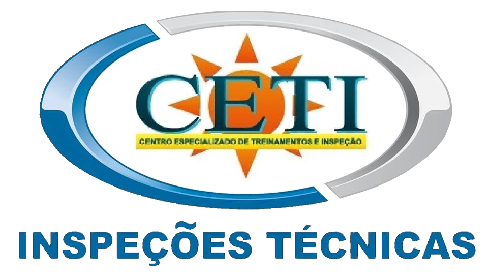
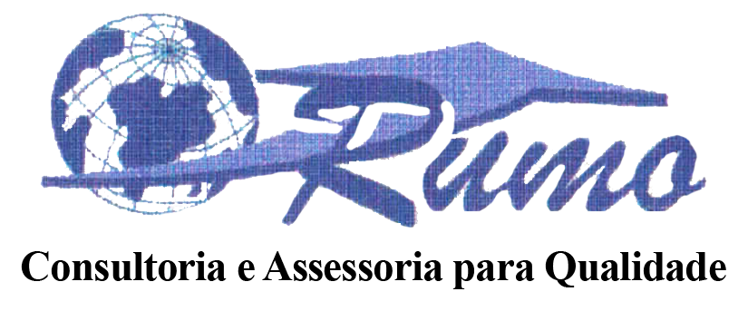
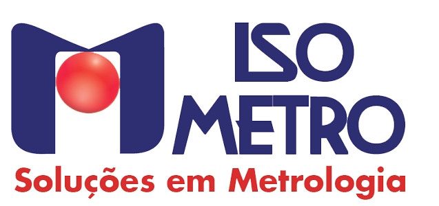
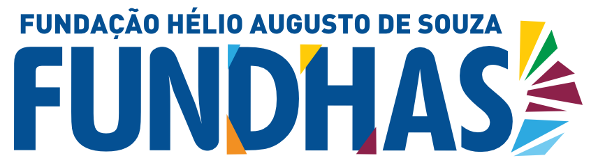

# **Alessandro Roberto dos Reis Santos**

<!DOCTYPE html><html lang="pt-BR"><head><meta charset="UTF-8"><meta name="viewport" content="width=device-width, initial-scale=1.0"><title>Exemplo de Imagem com Efeito de Órbita</title></head><body>

</body></html>

## **Introdução**

Todos os cursos profissionalizantes e de especialização destacados abaixo, estes cursados ao longo de minha carreira profissional, detém em cada um deles um PDF que são os respectivos certificados de conclusão para a realização do download e posteriores análises e apreciação.

### **Cursos Extracurriculares**

??? Success ":octicons-mortar-board-16: Curso SENAI - Ajustador Mecânico"

    > :material-book-education-outline: Início: 06/1996 :fontawesome-solid-flag-checkered: Conclusão: 06/1998

    {width="75%"}

    [https://sp.senai.br/unidade/saojosedoscampos](https://sp.senai.br/unidade/saojosedoscampos/){:target="_blank"}

    **Certificado de curso profissionalizante:** [:fontawesome-regular-file-pdf: Download](documentos/pdf/CERTIFICADO-AJUSTADOR-ARRS.pdf){:download="CERTIFICADO-AJUSTADOR-ARRS.pdf"}

    **Carga horária:** 3.273 horas (Antigo CAI :material-hand-pointing-right: Curso de Aprendizagem Industrial)

??? Success ":octicons-mortar-board-16: Curso SENAI - Programação e Operação de Centro de Usinagem CNC"

    > :material-book-education-outline: Início: 05/2014 :fontawesome-solid-flag-checkered: Conclusão: 07/2014

    {width="75%"}

    [https://sp.senai.br/unidade/saojosedoscampos](https://sp.senai.br/unidade/saojosedoscampos/){:target="_blank"}

    **Certificado de curso profissionalizante:** [:fontawesome-regular-file-pdf: Download](documentos/pdf/CERTIFICADO-PROGRAMACAO-ARRS.pdf){:download="CERTIFICADO-PROGRAMACAO-ARRS.pdf"}

    **Carga horária:** 120 horas

??? Success ":octicons-mortar-board-16: Curso SENAI - Segurança no Trabalho em Alturas - NR 35"

    > :material-book-education-outline: Início: 03/2013 :fontawesome-solid-flag-checkered: Conclusão: 03/2013

    {width="75%"}

    [https://sp.senai.br/unidade/saojosedoscampos](https://sp.senai.br/unidade/saojosedoscampos/){:target="_blank"}

    **Certificado de curso profissionalizante:** [:fontawesome-regular-file-pdf: Download](documentos/pdf/CERTIFICADO-NR35-ARRS.pdf){:download="CERTIFICADO-NR35-ARRS.pdf"}

    **Carga horária:** 8 horas

??? Success ":octicons-mortar-board-16: Curso SENAI - Tecnologia da Informação e Comunicação"

    > :material-book-education-outline: Início: 10/2018 :fontawesome-solid-flag-checkered: Conclusão: 10/2018

    {width="75%"}

    [https://sp.senai.br/unidade/saojosedoscampos](https://sp.senai.br/unidade/saojosedoscampos/){:target="_blank"}

    **Certificado de curso profissionalizante:** [:fontawesome-regular-file-pdf: Download](documentos/pdf/CERTIFICADO-TI-ARRS.pdf){:download="CERTIFICADO-TI-ARRS.pdf"}

    **Carga horária:** 14 horas

??? Success ":octicons-mortar-board-16: Curso SENAI - Empreendedorismo"

    > :material-book-education-outline: Início: 08/2019 :fontawesome-solid-flag-checkered: Conclusão: 08/2019

    {width="75%"}

    [https://sp.senai.br/unidade/saojosedoscampos](https://sp.senai.br/unidade/saojosedoscampos/){:target="_blank"}

    **Certificado de curso profissionalizante:** [:fontawesome-regular-file-pdf: Download](documentos/pdf/CERTIFICADO-EMPREENDEDORISMO-ARRS.pdf){:download="CERTIFICADO-EMPREENDEDORISMO-ARRS.pdf"}

    **Carga horária:** 20 horas

??? Success ":octicons-mortar-board-16: Curso SENAI - Finanças Pessoais"

    > :material-book-education-outline: Início: 09/2019 :fontawesome-solid-flag-checkered: Conclusão: 09/2019

    {width="75%"}

    [https://sp.senai.br/unidade/saojosedoscampos](https://sp.senai.br/unidade/saojosedoscampos/){:target="_blank"}

    **Certificado de curso profissionalizante:** [:fontawesome-regular-file-pdf: Download](documentos/pdf/CERTIFICADO-FINANCAS-ARRS.pdf){:download="CERTIFICADO-FINANCAS-ARRS.pdf"}

    **Carga horária:** 14 horas

??? Success ":octicons-mortar-board-16: Curso SENAI - Videomaker - Edição de Vídeos"

    > :material-book-education-outline: Início: 06/2021 :fontawesome-solid-flag-checkered: Conclusão: 06/2021

    {width="75%"}

    [https://sp.senai.br/unidade/saojosedoscampos](https://sp.senai.br/unidade/saojosedoscampos/){:target="_blank"}

    [https://sebrae.com.br](https://sebrae.com.br/sites/PortalSebrae){:target="_blank"}

    **Certificado de curso profissionalizante (SENAI):** [:fontawesome-regular-file-pdf: Download](documentos/pdf/CERTIFICADO-VIDEOMAKER-SENAI-ARRS.pdf){:download="CERTIFICADO-VIDEOMAKER-SENAI-ARRS.pdf"}

    **Certificado de curso profissionalizante (SEBRAE):** [:fontawesome-regular-file-pdf: Download](documentos/pdf/CERTIFICADO-VIDEOMAKER-SEBRAE-ARRS.pdf){:download="CERTIFICADO-VIDEOMAKER-SEBRAE-ARRS.pdf"}

    **Carga horária:** 68 horas

    **Observação:** Curso ofertado pelo SEBRAE e ministrado pela escola SENAI "Santos Dumont".

??? Success ":octicons-mortar-board-16: Curso CETI Treinamentos - Segurança nas Operações de Caldeiras e Vasos de Pressão - NR 13"

    > :material-book-education-outline: Início: 04/2013 :fontawesome-solid-flag-checkered: Conclusão: 05/2013

    {width="25%"}

    [https://ceti-treinamentos-e-servicos.webnode.page](https://ceti-treinamentos-e-servicos.webnode.page/){:target="_blank"}

     **Certificado de curso profissionalizante:** [:fontawesome-regular-file-pdf: Download](documentos/pdf/CERTIFICADO-NR13-ARRS.pdf){:download="CERTIFICADO-NR13-ARRS.pdf"}

    **Carga horária:** 40 horas

??? Success ":octicons-mortar-board-16: Curso Rumo Consultoria e Assessoria para Qualidade - Auditor Interno da Qualidade"

    > :material-book-education-outline: Início: 10/2003 :fontawesome-solid-flag-checkered: Conclusão: 10/2003

    {width="28%"}

    **Certificado de curso profissionalizante:** [:fontawesome-regular-file-pdf: Download](documentos/pdf/CERTIFICADO-AUDITOR-ARRS.pdf){:download="CERTIFICADO-AUDITOR-ARRS.pdf"}

    **Carga horária:** 16 horas

??? Success ":octicons-mortar-board-16: Curso ISOMETRO - Instrumentos de Medição - Cuidados Básicos"

    > :material-book-education-outline: Início: 03/2002 :fontawesome-solid-flag-checkered: Conclusão: 03/2002

    {width="25%"}

    [https://www.isometro.com.br](https://www.isometro.com.br/){:target="_blank"}

    **Certificado de curso profissionalizante:** [:fontawesome-regular-file-pdf: Download](documentos/pdf/CERTIFICADO-ISOMETRO-ARRS.pdf){:download="CERTIFICADO-ISOMETRO-ARRS.pdf"}

    **Carga horária:** 1,5 horas

??? Success ":octicons-mortar-board-16: Curso Fundhas - Auxiliar Administrativo"

    > :material-book-education-outline: Início: 10/1999 :fontawesome-solid-flag-checkered: Conclusão: 11/1999

    {width="27%"}

    [https://fundhas.org.br](https://fundhas.org.br/){:target="_blank"}

    **Certificado de curso profissionalizante:** [:fontawesome-regular-file-pdf: Download](documentos/pdf/CERTIFICADO-AUX-ADM-ARRS.pdf){:download="CERTIFICADO-AUX-ADM-ARRS.pdf"}

    **Carga horária:** 98 horas

<!DOCTYPE html>
<html lang="pt-br">
<head>
    <meta charset="UTF-8">
    <meta name="viewport" content="width=device-width, initial-scale=1.0">
    <title>Ícone do WhatsApp</title>
    
</head>
<body>
    <!-- Ícone do WhatsApp como imagem PNG -->
    

    
</body>
</html>

