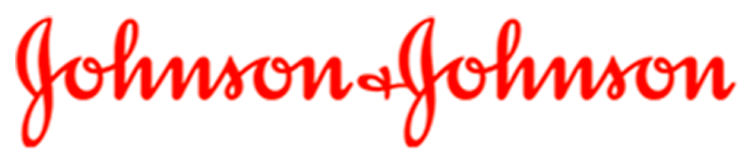
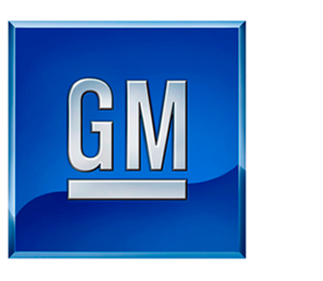
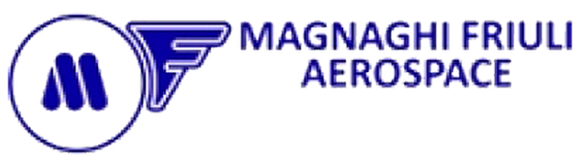
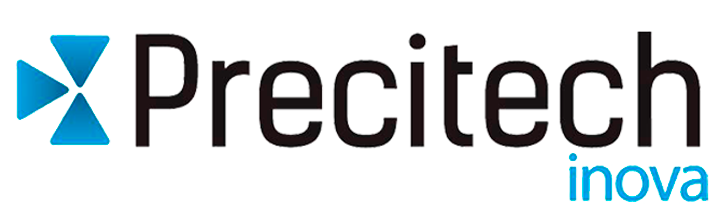
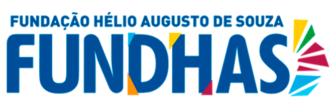

# **Alessandro Roberto dos Reis Santos**
{width="25%" .left-image}

---

## **Grupo Card**

{width="30%"}

[https://www.grupocard.com.br](https://www.grupocard.com.br/){:target="_blank"}

> :material-badge-account-horizontal-outline: Entrada: 05/2023 :fontawesome-regular-handshake: Saída: 10/2023

**Cargo:** Assistente de Suporte Técnico (Service Desk)

**Departamento:** Tecnologia da Informação

**Modalidade:** CLT

**Atribuições:** 
Integrante de equipe de suporte técnico/TI atuante com autonomia e diretamente no negócio da empresa ante às necessidades dos representantes do Grupo Card, prestando suporte orientado ao _troubleshooting_ dos mesmos, tendo como missão única e principal atender e superar as necessidades de nossos clientes finais, contemplando ainda ampla participação na elaboração e desenvolvimento de toda a documentação técnica da empresa no formato [_MkDocs_](https://squidfunk.github.io/mkdocs-material/){:target="_blank"}.

**Competências técnicas/comportamentais desenvolvidas:**

* _DevOps_ (_Markdown - HTML - CSS - JS - Git_);
* Editor de vídeos e imagens;
* _Wiki_ (Elaboração e desenvolvimento de documentação técnica no formato [_MkDocs_](https://squidfunk.github.io/mkdocs-material/){:target="_blank"});
* Suporte de _hardware_ de TI;
* Suporte técnico de _mobile_;
* Suporte para _help desk_; 
* Suporte de periféricos (impressoras - _notebooks - desktops - nobreaks_);
* Infraestrutura e segurança de redes;
* Relacionamento interpessoal;
* Comunicação verbal e escrita.
* Trabalho em equipe;
* Resiliência.

!!! info " **Perfil Profissiográfico Previdenciário (PPP) - Tecnologia da Informação/Suporte Técnico**"
    * **Profissioagrafia / Descrição das Atividades Laborais**
        
        [:fontawesome-regular-file-pdf: Download](documentos/pdf/PPP-ASSISTENTE-DE-SUPORTE-TECNICO.pdf){:download="PPP-ASSISTENTE-DE-SUPORTE-TECNICO.pdf"} para análise e apreciação.

---
## **Proz Educação**

{width="30%"}

[https://prozeducacao.com.br](https://prozeducacao.com.br/){:target="_blank"}

> :material-badge-account-horizontal-outline: Entrada: 01/2023 :fontawesome-regular-handshake: Saída: 03/2023

**Cargo:** Docente de cursos técnicos (Administração e Logística)

**Departamento:** Pedagógico (educacional)

**Escola:** E.E. PEI Profº "Dorothoveo Gaspar Vianna" (Jacareí - SP)

**Modalidade:** Contrato RPA (autônomo)

**Atribuições:** 
Atuante como docente de cursos técnicos tendo como cliente principal os alunos da rede pública do ensino médio, em que o escopo e a missão fora a de repassar e transmitir conhecimentos técnicos de conceitos e disciplinas específicas dos cursos técnicos de Administração e de Logística juntamente com exemplos empíricos vivenciados no passado e atuais acerca de cada curso, ambos voltados e em congruência com a situação sócioeconômica atual do município de Jacareí e da região metropolitana do Vale do Paraíba.

**Competências técnicas/comportamentais desenvolvidas:**

* Domínio técnico-pedagógico;
* Relacionamento interpessoal;
* Comunicação verbal e escrita;
* Equilíbrio emocional;
* Trabalho em equipe;
* Resiliência; 
* Criatividade;
* Liderança institucional e pedagógica.

---

## **Johnson & Johnson**

{width="33%"}

[https://www.jnjbrasil.com.br](https://www.jnjbrasil.com.br/){:target="_blank"}

> :material-badge-account-horizontal-outline: Entrada: 03/2015 :fontawesome-regular-handshake: Saída: 07/2022

**Cargo:** Operador de Produção Especializado

**Departamento:** Embalagem/Suturas (Planta: _Medical_)

**Modalidade:** CLT

**Atribuições:** 
Experiência e vivência em manufatura informatizada com ênfase na entrada da produção nos sistemas _SAP, TOTVS e MAXIMUS,_ atuante em ambiente fabril no departamento de embalagens de suturas da planta _Medical_.

**Competências técnicas/comportamentais desenvolvidas:**

* _SAP_;
* _TOTVS_;
* _MAXIMUS_;
* Relacionamento interpessoal;
* Comunicação verbal e escrita;
* Equilíbrio emocional;
* Trabalho em equipe;
* Resiliência.

---

## **PMSJC**

{width="23%"}

[https://www.sjc.sp.gov.br](https://www.sjc.sp.gov.br/){:target="_blank"}

> :material-badge-account-horizontal-outline: Entrada: 04/2016 :fontawesome-regular-handshake: Saída: 11/2016

**Cargo:** Estagiário 

**Departamento:** Tecnologia da Informação

**Modalidade:** Estágio

**Atribuições:** 
Atuante no acompanhamento de todo o funcionamento da rede interna e do servidor *Windows Server (Active Directory)* da repartição pública, criando usuários e definindo permissões aos mesmos, bem como o acompanhamento e análise das bordas nos sistemas relacionada à segurança da informação, além de deter experiência com cabeamento estruturado *(EIA/TIA)* e funções específicas ao suporte técnico remoto e presencial, no que tange à instalação e à configuração de *softwares* em geral como *Office 365*, *troubleshooting* dos sistemas SIPEX e GED, bem como configurações em gerais de *hardwares* e dispositivos de redes, realizando manutenções de periféricos e formatações em geral (Impressoras; *Desktops*; *Laptops* e demais dispositivos de *hardware*).

**Competências técnicas/comportamentais desenvolvidas:**

* *Windows Server (Active Directory);*
* *Linux (FreeBSD);*
* Cabeamento estruturado *(EIA/TIA);*
* *Office 365;*
* SIPEX;
* GED;
* Suporte técnico;
* Manutenção de periféricos e hardware;
* Relacionamento interpessoal;
* Comunicação verbal e escrita;
* Equilíbrio emocional;
* Trabalho em equipe;
* Resiliência.

---

## **PMSJC**

{width="23%"}

[https://www.sjc.sp.gov.br](https://www.sjc.sp.gov.br/){:target="_blank"}

> :material-badge-account-horizontal-outline: Entrada: 12/2014 :fontawesome-regular-handshake: Saída: 03/2015

**Cargo:** Estagiário

**Departamento:** Protocolo

**Modalidade:** Estágio

**Atribuições:** 
Atuante no departamento de protocolo e processos com escopo específico no atendimento ao munícipe e ao público em geral; Cópia e extração de documentos diversos; Análise e tramitação de documentos de inteiro teor; Envio e recebimento de correspondências; Envio e recebimento de *e-mails* diversos; Análise e elaboração de memorandos diversos; Acesso irrestrito a documentações públicas, contratos, licitações, plantas e documentos de particulares em formato digital; Acesso e domínio administrativo relacionado ao sistema informatizado SIPEX.

**Competências técnicas/comportamentais desenvolvidas:**

* SIPEX;
* GED;
* Documentação administrativa;
* Relacionamento interpessoal;
* Comunicação verbal e escrita;
* Equilíbrio emocional;
* Trabalho em equipe;
* Resiliência.
---

## **General Motors**

{width="27%"}

[https://www.gm.com](https://www.gm.com/){:target="_blank"}

> :material-badge-account-horizontal-outline: Entrada: 06/2004 :fontawesome-regular-handshake: Saída: 12/2013

**Cargos:**

* Programador e Operador de Centro de Usinagem CNC (6 anos);
* Preparador de Pintura (1 ano);
* Coordenador de Times (6 meses);
* Operador de Utilidades ETA/ETE (2 anos).

**Departamentos:** 

* Powertrain (Usinagem);
* Injetora de Plásticos (Injetoras/Pintura/Ferramentaria);
* Utilidades (Casas de Bombas/ETA-ETE/Complexo SJC-SP).

**Modalidade:** CLT

**Atribuições:** 

<strong>6 anos:</strong> Atuante no cargo e função de <strong> Programador e Operador de Centro de Usinagem CNC</strong>  na planta powertrain, na área de motores e transmissões, contemplando atuação diária na inspeção visual e dimensional de girabrequins, carcaças e eixos-comando, com ampla participação na elaboração e planejamento de documentações técnicas, no que tange aos processos industriais de usinagem e montagem nas áreas de válvulas, eixos-comando, carcaça e girabrequim;

<strong>1 ano e 6 meses:</strong> Atuante no cargo e função de <strong> Coordenador</strong> , com escopo de "Facilitador de Times" na planta de injetoras de plásticos e componentes, nas áreas de injetoras e pintura, contemplando ainda atuação em atividades extracurriculares na área/departamento de ferramentaria, atuando como <strong> Ferramenteiro</strong>  com ênfase em inspeção, realizando e desenvolvendo trabalhos de manutenções corretivas e preventivas em moldes termodinâmicos de injeção plástica de para-choques (S-10, Blazer e veículos populares);

<strong>2 anos:</strong> Atuante no cargo e função de <strong>Operador de Utilidades e Caldeiras</strong> em todo o complexo de São José dos Campos/SP,  na área de operação e manutenção de utilidades, com experiência em gerenciamento de consumo (gases GNV e GLP, vapor, ar comprimido, água desmineralizada, água potável, água gelada, condensados, óleo e combustíveis) fazendo o uso de manobras em gerais em casas de forças/caldeiras, casas de bombas, poços artesianos e operação em geral de bombas, torres de resfriamento, compressores de ar dos tipos parafusos e centrífugos (5.200 <em>cfm</em>), compressores <em>chiller's</em> e máquinas de absorção, trocadores de calor, desaeradores, máquinas e equipamentos de utilidades em geral, bem como experiência e vivenciamento em estações de tratamento de água e efluentes em geral (ETA/ETE) com participação direta e efetiva na operação de todo o processo de tratamento de efluentes industriais, domésticos e oleosos, contemplando ainda ampla atuação em manutenções preventivas e corretivas de bombas centrífugas, máquinas e sistemas (linhas) de utilidades fazendo o uso frequente de filosofias e ferramentas da qualidade como: <em>Lean Manufacturing, TPM, 5W2H, KAIZEN, TOC</em> (máquinas e linhas gargalos), <em>6S, FiFo, Justin Time, SWE,</em> etc.

**Competências técnicas/comportamentais desenvolvidas:**

* _GMS (Global Manufacturing System_);
* Programação CAD/CAM;
* Processos de Usinagem (Elaboração de documentação técnica);
* Segurança do trabalho;
* NR-35 (Trabalho em Alturas);
* NR-13 (Segurança nas Operações de Caldeiras e Vasos de Pressão)
* Relacionamento interpessoal;
* Comunicação verbal e escrita;
* Equilíbrio emocional;
* Trabalho em equipe;
* Resiliência; 
* Criatividade;
* Liderança e coordenação.

---

## **Magnaghi Friuli Aerospace**

{width="35%"}

[https://www.magroup.net](https://www.magroup.net/){:target="_blank"}

> :material-badge-account-horizontal-outline: Entrada: 06/2003 :fontawesome-regular-handshake: Saída: 06/2004

**Cargos:** 

* Ajustador Mecânico III;
* Líder/Encarregado de Produção.

**Departamentos:** 

* Ajustagem Mecânica;
* Usinagem;
* Inspeção.

**Modalidade:** CLT

**Atribuições:** 
Atuante com o cargo de **Ajustador Mecânico III**, com função específica e interina de **Líder/Encarregado de Produção**, com ênfase em gestão/coordenação de pessoas e de todos os processos fabris de usinagem, ajustes, acabamento e inspeções, realizando o acompanhamento de todas as etapas da produção de peças do segmento aeronáutico com priorização na inspeção do acabamento e ajustes atrelados ao **padrão Embraer**, fazendo o uso irrestrito de instrumentos tridimensionais de medição, acompanhado de leitura e interpretação de desenhos técnicos, sempre com o escopo no atendimento e superação da satisfação do cliente, linkando valores e metas na "Qualidade Total do Produto" estipulados e delegados pela direção e liderança da empresa.

**Competências técnicas/comportamentais desenvolvidas:**

* Usinagem CNC e convencional;
* Ajustes e acabamento;
* Inspeção técnica e tridimensional;
* Relacionamento interpessoal;
* Comunicação verbal e escrita;
* Equilíbrio emocional;
* Trabalho em equipe;
* Resiliência;
* Criatividade;
* Liderança e coordenação.

---

## **Precitech Inova**

{width="33%"}

[https://pffinova.com.br](https://pffinova.com.br/){:target="_blank"}

> :material-badge-account-horizontal-outline: Entrada: 09/2001 :fontawesome-regular-handshake: Saída: 05/2003

**Cargo:** Ajustador Ferramenteiro

**Departamento:** Ferramentaria e Usinagem

**Modalidade:** CLT

**Atribuições:** 
Atuante com o cargo e função de **Ajustador Ferramenteiro**, contemplando funções e experiência em ferramentaria e ajustagem de bancada (confecção de ferramental em geral), leitura e interpretação de desenhos técnicos diversos, uso e manejo de instrumentos precisos de medições, bem como experiência vivenciada em eletro-erosão CNC a fio (Actspark) e á penetração (Engemaq), retíficas plana e cilíndrica, fresadoras CN e universais, furadeiras sensitivas e de coluna, afiação de ferramentas operacionais, ajustes e acabamentos em conjuntos de ferramentais, em específico às ferramentas de formação, selagem, corte, punções e matrizes, sendo todo este tipo de ferramental direcionados ao cliente e setor segmentado farmacêutico (laboratórios), em específico e atrelados á confecção e produção seriada do blister flex, havendo também uma ampla atuação na função de **Assistente Técnico** junto á vários clientes da indústria farmacêutica, sendo estes alocados no Brasil e no México.

**Competências técnicas/comportamentais desenvolvidas:**

* Usinagem CNC e convencional;
* Ajustes e acabamento fino em bancada;
* Inspeção técnica;
* Relacionamento interpessoal;
* Comunicação verbal e escrita;
* Equilíbrio emocional;
* Trabalho em equipe;
* Resiliência;
* Criatividade.

---

## **Ferrusmol**

{width="33%"}

[https://ferrusmol.com.br](https://ferrusmol.com.br/){:target="_blank"}

> :material-badge-account-horizontal-outline: Entrada: 10/2000 :fontawesome-regular-handshake: Saída: 05/2001

**Cargo:** Operador de Torno Automático

**Departamento:** Ferramentaria e Usinagem

**Modalidade:** CLT

**Atribuições:** 
Atuante com o cargo e função de **Operador de Torno Automático**, com experiência em preparações de máquinas e ferramentas, atreladas juntamente com o acompanhamento e aferições da usinagem na confecção de peças seriadas, estas  direcionadas ao setor industrial de telefonia fixa e celulares.

**Competências técnicas/comportamentais desenvolvidas:**

* Usinagem convencional;
* Preparação de máquinas e ferramentas;
* Inspeção técnica e visual;
* Relacionamento interpessoal;
* Comunicação verbal e escrita;
* Equilíbrio emocional;
* Trabalho em equipe;
* Resiliência;
* Criatividade.

---

## **ITA/CTA**

{width="33%"}

[http://www.ita.br](http://www.ita.br/){:target="_blank"}

> :material-badge-account-horizontal-outline: Entrada: 04/1999 :fontawesome-regular-handshake: Saída: 09/2000

**Cargo:** Estagiário/Instrutor

**Departamento:** Laboratório Mecânico

**Modalidade:** Estágio

**Atribuições:** 
Atuação com o cargo e função de **Estagiário de Suporte**, com função interina de **Instrutor e de Suporte de Ensino** em laboratório mecânico da disciplina de "laboratório" aos alunos de 2º ano de engenharia mecânica do ITA-CTA (Divisão de Engenharia Mecânica - Aeronáutica), realizando e transmitindo conhecimentos específicos e tecnológicos de como proceder ao manusear máquinas operatrizes, ferramentas manuais, leitura e interpretação de desenhos técnicos juntamente com aferições em peças com instrumentos de medições de extrema precisão.

**Competências técnicas/comportamentais desenvolvidas:**

* Domínio técnico-operacional-pedagógico;
* Usinagem convencional;
* Preparação de máquinas e ferramentas;
* Inspeção técnica e visual;
* Relacionamento interpessoal;
* Comunicação verbal e escrita;
* Equilíbrio emocional;
* Trabalho em equipe;
* Resiliência;
* Criatividade.

---

## **Fundhas**

{width="33%"}

[https://fundhas.org.br](https://fundhas.org.br/){:target="_blank"}

> :material-badge-account-horizontal-outline: Entrada: 07/1996 :fontawesome-regular-handshake: Saída: 05/2000

**Cargo:** Auxiliar Administrativo

**Departamento:** Administrativo (RH/Departamento Pessoal)

**Modalidade:** CLT

**Atribuições:** 
Atuação com o cargo de **Auxiliar Administrativo**, com em experiência empírica em: Tratação de documentações diversos; Preenchimento de documentações eletrônicas em ambiente *MS Office*; Preparação e análise de contratos diversos, bem como relatórios, memorandos internos e planilhas eletrônicas em ambiente *MS Office*; Análise e acompanhamento de processos administrativos via sistema interno; Atendimento de clientes e/ou fornecedores; Execução de rotinas diárias e apoio em Recursos Humanos e Departamento Pessoal via sistemas interno e externo; Prestação de apoio em demandas logísticas.

**Competências técnicas/comportamentais desenvolvidas:**

* Rotinas administrativas correlatas;
* Atendimentos a clientes internos e externos;
* Relacionamento interpessoal;
* Comunicação verbal e escrita;
* Equilíbrio emocional;
* Trabalho em equipe;
* Resiliência; 
* Criatividade.

!!! info " **Perfil Profissiográfico Previdenciário (PPP) - Administrativo**"
    * **Profissiografia / Descrição das Atividades Laborais**
        
        [:fontawesome-regular-file-pdf: Download](documentos/pdf/PPP-AUXILIAR-ADMINISTRATIVO.pdf){:download="PPP-AUXILIAR-ADMINISTRATIVO.pdf"} para análise e apreciação.