# **Alessandro Roberto dos Reis Santos**

<!DOCTYPE html><html lang="pt-BR"><head><meta charset="UTF-8"><meta name="viewport" content="width=device-width, initial-scale=1.0"></head><body>

</body></html>

## **Experiência Profissional**

??? Success ":fontawesome-solid-dumbbell: Phoenix Box & Fit"
    {width="40%"}

    [@phoenix_fit_sjc](https://www.instagram.com/phoenixbox_fit_sjc/){:target="_blank"}

    > :material-badge-account-horizontal-outline: Entrada: 06/2026 :fontawesome-regular-handshake: Saída: Até o momento

    **Segmento da Empresa:** Fítness e saúde

    **Cargo:** Estagiário de Educação Física

    **Departamento:** Musculação

    **Modalidade:** Estágio

    **Atribuições:** 
Acompanhamento e orientação de alunos na sala de musculação, auxiliando na execução correta e segura dos exercícios; apoio na montagem e ajuste de treinos conforme objetivos individuais; organização do ambiente e dos equipamentos; observação postural, correção de movimentos e prevenção de lesões sob supervisão profissional; atendimento ao público e esclarecimento de dúvidas sobre uso dos aparelhos.

    **Competências técnicas/comportamentais desenvolvidas:**

    * Fundamentos de musculação e treinamento resistido;
    * Orientação e correção de exercícios físicos;
    * Atendimento ao público;
    * Relacionamento interpessoal;
    * Comunicação verbal;
    * Trabalho em equipe;
    * Responsabilidade e ética profissional;
    * Equilíbrio emocional;
    * Resiliência;
            
    

    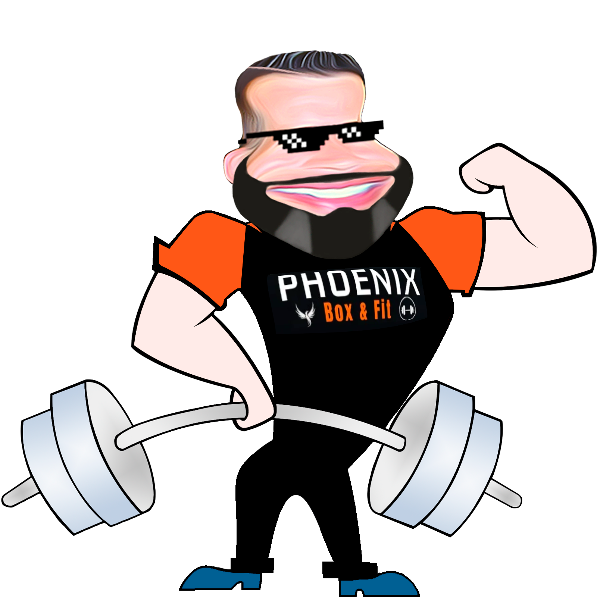{width="50%"}
    

    ---
    **Referências das Experiências Laborais - Liderança Phoenix**

    * Contato/Supervisão :material-hand-pointing-right: [(12) 99176-4711](https://wa.me/5512991764711){:target="_blank"}
    
??? Success ":fontawesome-solid-dumbbell: Panobianco Academia"
    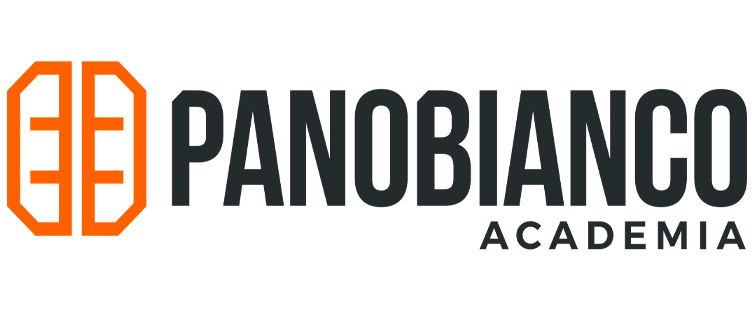{width="33%"}

    [@panobiancosjcmontecastelo](https://www.instagram.com/panobiancosjcmontecastelo/){:target="_blank"}

    > :material-badge-account-horizontal-outline: Entrada: 03/2026 :fontawesome-regular-handshake: Saída: 05/2026

    **Segmento da Empresa:** Fítness e saúde

    **Cargo:** Estagiário de Educação Física

    **Departamento:** Musculação

    **Modalidade:** Estágio

    **Atribuições:** 
Acompanhamento e orientação de alunos na sala de musculação, auxiliando na execução correta e segura dos exercícios; apoio na montagem e ajuste de treinos conforme objetivos individuais; organização do ambiente e dos equipamentos; observação postural, correção de movimentos e prevenção de lesões sob supervisão profissional; atendimento ao público e esclarecimento de dúvidas sobre uso dos aparelhos.

    **Competências técnicas/comportamentais desenvolvidas:**

    * Fundamentos de musculação e treinamento resistido;
    * Orientação e correção de exercícios físicos;
    * Atendimento ao público;
    * Relacionamento interpessoal;
    * Comunicação verbal;
    * Trabalho em equipe;
    * Responsabilidade e ética profissional;
    * Equilíbrio emocional;
    * Resiliência;
    * Montagem, ajustes e prescrição de treinos individuais via sistema ABC EVO.
        
        [:material-hand-pointing-right: Acesso online ao sistema ABC EVO](https://evo5.w12app.com.br/#/acesso/panobiancos/autenticacao){:target="_blank"}
    

    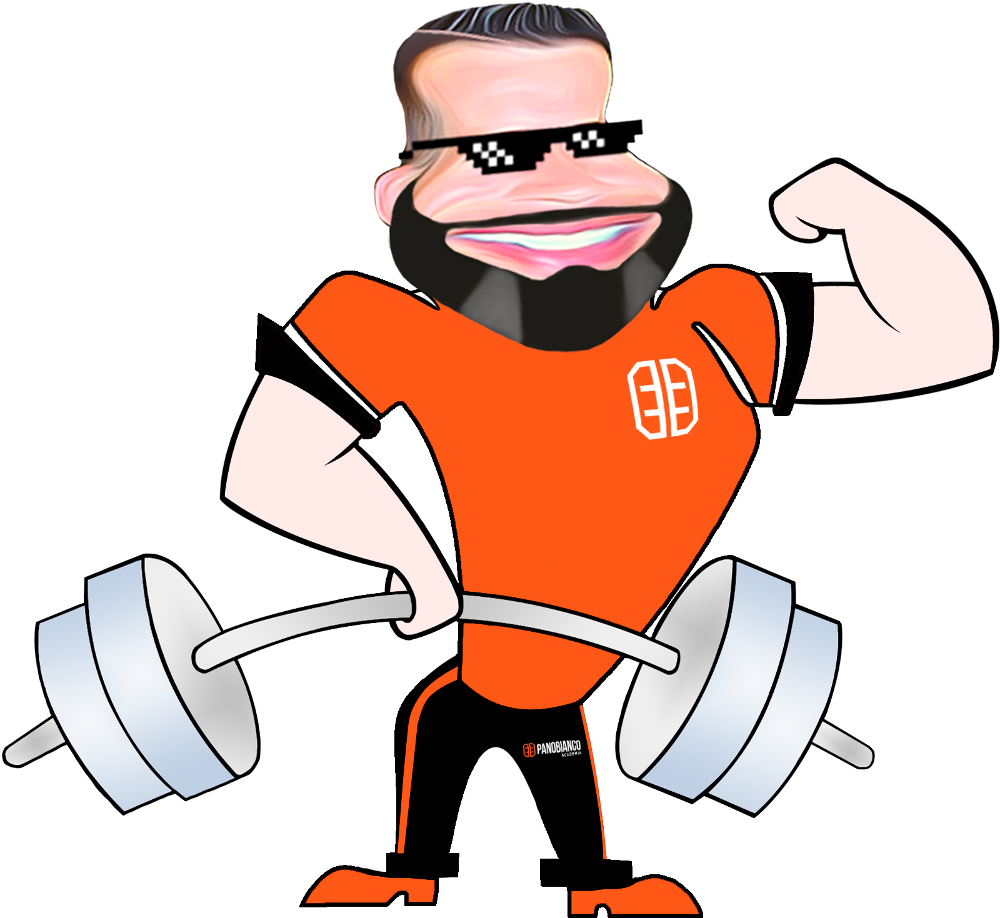{width="50%"}
    

    ---
    **Referências das Experiências Laborais - Liderança Panobianco**

    * Contato/Supervisão :material-hand-pointing-right: [(19) 97411-1164](https://wa.me/5519974111164){:target="_blank"}

??? Success ":fontawesome-solid-dumbbell: Novo Impacto Academia"
    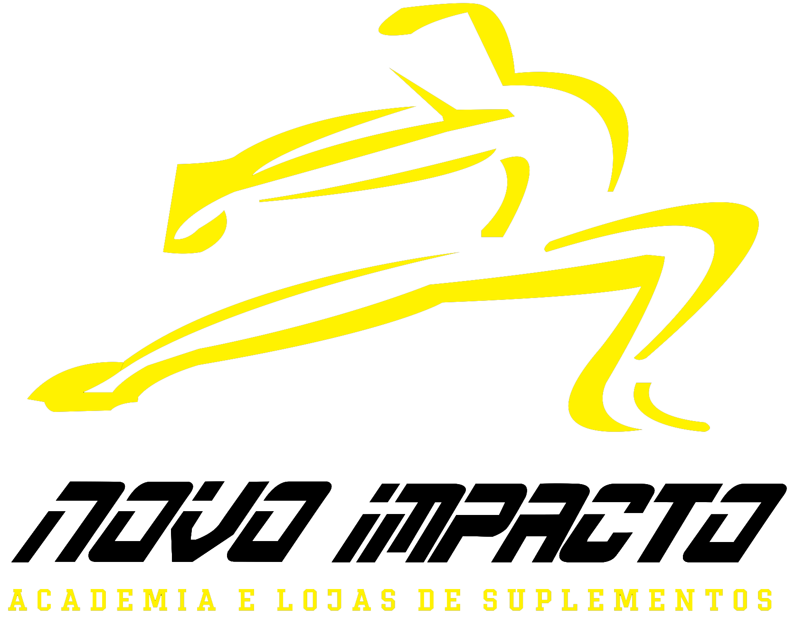{width="33%"}

    [@novoimpactoacademia](https://www.instagram.com/novoimpactoacademia/){:target="_blank"}

    > :material-badge-account-horizontal-outline: Entrada: 02/2026 :fontawesome-regular-handshake: Saída: 04/2026

    **Segmento da Empresa:** Fítness e saúde

    **Cargo:** Estagiário de Educação Física

    **Departamento:** Musculação

    **Modalidade:** Estágio

    **Atribuições:** 
Suporte técnico aos alunos durante as atividades de treinamento resistido, assegurando a correta execução dos exercícios e a segurança na utilização dos equipamentos; colaboração na elaboração e atualização de programas de treino conforme metas e necessidades individuais; organização, zelo e manutenção pelo espaço físico e aparelhos; monitoramento postural e orientação preventiva para redução de riscos de lesões sob supervisão do profissional responsável; atendimento aos alunos, prestando esclarecimentos sobre métodos de treino e funcionamento dos equipamentos.

    **Competências técnicas/comportamentais desenvolvidas:**

    * Princípios aplicados ao treinamento resistido e à musculação;
    * Monitoramento e ajustes técnicos na execução de exercícios;
    * Atendimento e suporte ao cliente;
    * Habilidade de comunicação interpessoal;
    * Comunicação clara e objetiva;
    * Atuação colaborativa em equipe multidisciplinar;
    * Postura ética e responsabilidade profissional;
    * Inteligência emocional no ambiente esportivo;
    * Capacidade de adaptação a diferentes perfis de alunos;
    * Atuação em rodízio operacional no ambiente de musculação, assegurando suporte contínuo;
    * Prescrição e atualização de treinos individualizados em sistema digital de gestão.

        [:material-hand-pointing-right: Acesso online ao sistema Pacto Soluções](https://lgn.pactosolucoes.com.br/pt/auth){:target="_blank"}
    

    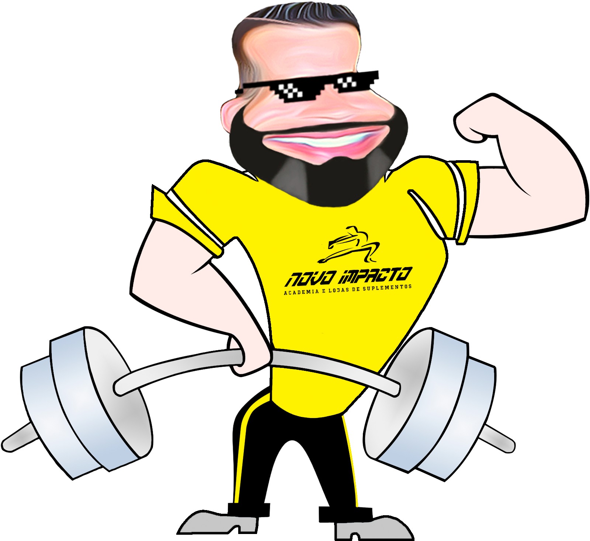{width="50%"}
    

    ---
    **Referências das Experiências Laborais - Liderança Novo Impacto**

    * Contato/Supervisão :material-hand-pointing-right: [(12) 99746-2207](https://wa.me/5512997462207){:target="_blank"}
        
??? Success ":fontawesome-solid-dumbbell: SkyFit Academia"
    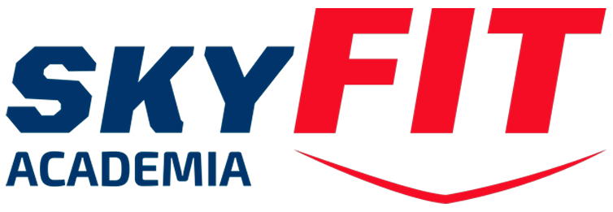{width="33%"}

    [@skyfitsaojosedoscampos](https://www.instagram.com/skyfitsaojosedoscampos/){:target="_blank"}

    > :material-badge-account-horizontal-outline: Entrada: 10/2025 :fontawesome-regular-handshake: Saída: 02/2026

    **Segmento da Empresa:** Fítness e saúde

    **Cargo:** Estagiário de Educação Física

    **Departamento:** Musculação

    **Modalidade:** Estágio

    **Atribuições:** 
Acompanhamento e orientação de alunos na sala de musculação, auxiliando na execução correta e segura dos exercícios; apoio na montagem e ajuste de treinos conforme objetivos individuais; organização do ambiente e dos equipamentos; observação postural, correção de movimentos e prevenção de lesões sob supervisão profissional; atendimento ao público e esclarecimento de dúvidas sobre uso dos aparelhos.

    **Competências técnicas/comportamentais desenvolvidas:**

    * Fundamentos de musculação e treinamento resistido;
    * Orientação e correção de exercícios físicos;
    * Atendimento ao público;
    * Relacionamento interpessoal;
    * Comunicação verbal;
    * Trabalho em equipe;
    * Responsabilidade e ética profissional;
    * Equilíbrio emocional;
    * Resiliência;
    * Montagem, ajustes e prescrição de treinos individuais via sistema ABC EVO.
        
        [:material-hand-pointing-right: Acesso online ao sistema ABC EVO](https://evo5.w12app.com.br/#/acesso/skyfitacademia/autenticacao){:target="_blank"}
    

    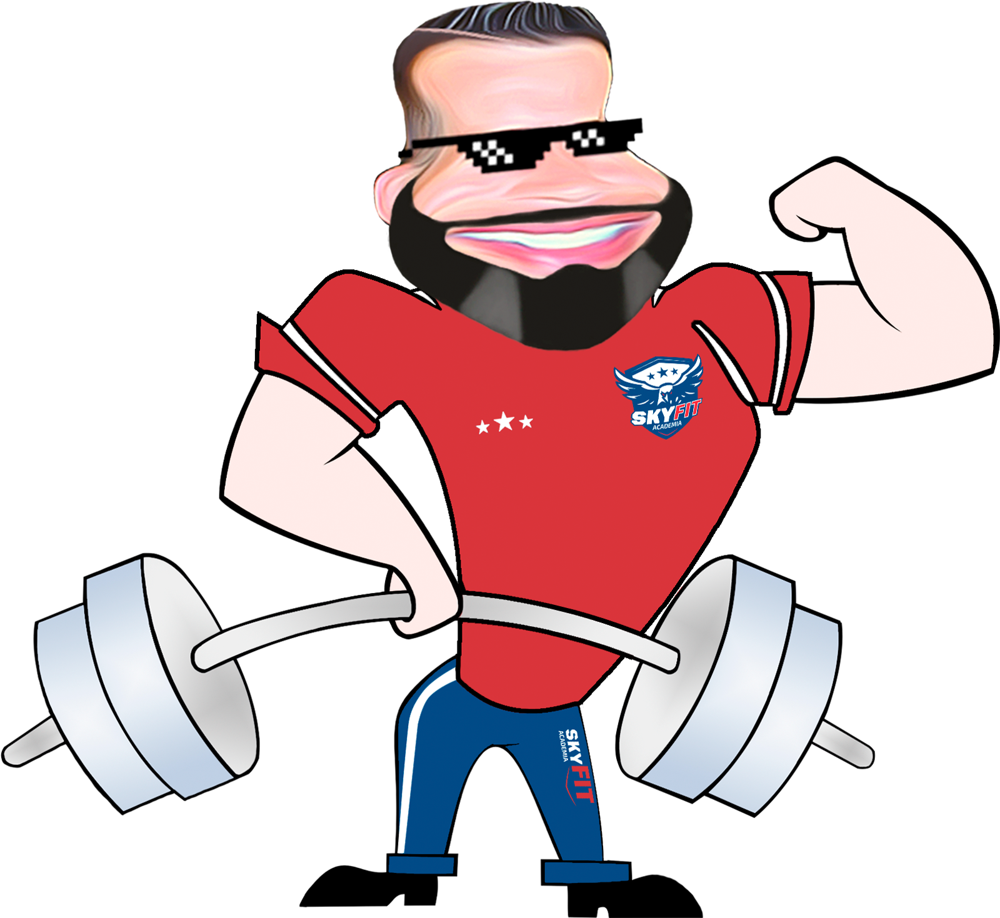{width="50%"}
    

    ---
    **Referências das Experiências Laborais - Liderança SkyFit**

    * Contato/Gerência :material-hand-pointing-right: [(12) 99779-8871](https://wa.me/5512997798871){:target="_blank"}

??? Success ":material-laptop: Cardway"
    {width="30%"}

    [https://www.cardway.com.br](https://www.cardway.com.br/){:target="_blank"}

    > :material-badge-account-horizontal-outline: Entrada: 05/2023 :fontawesome-regular-handshake: Saída: 10/2023

    **Segmento da Empresa:** Comércio Financeiro e Tecnologia da Informação

    **Cargo:** Assistente de Suporte Técnico (Service Desk)

    **Departamento:** Tecnologia da Informação

    **Modalidade:** CLT

    **Atribuições:** 
Integrante de equipe de suporte técnico/TI atuante com autonomia e diretamente no negócio da empresa ante às necessidades dos representantes e dos colaboradores da Cardway, prestando suporte orientado ao _troubleshooting_ dos mesmos, tendo como missão única e principal atender e superar as necessidades de nossos colaboradores internos e clientes finais, com ênfase em suporte técnico de _hardware_, _mobile_ e de periféricos diversos, além de experiência empírica em cabeamento estruturado _(EIA/TIA)_, contemplando ainda ampla participação na elaboração de toda a documentação técnica da empresa em ambiente de desenvolvimento de programação.

    **Competências técnicas/comportamentais desenvolvidas:**

    * _DevOps_ (_Markdown - Material for MkDocs - HTML5 - CSS3 - JavaScript - Git - GitHub_);
    * Editor de vídeos e imagens;
    * _Wiki_ (Elaboração e desenvolvimento de documentação técnica no formato [_Material for MkDocs_](https://squidfunk.github.io/mkdocs-material/){:target="_blank"});
    * Suporte de _hardware_ de TI;
    * Suporte técnico de _mobile_;
    * Suporte para _help desk_;
    * Suporte de periféricos (impressoras - _notebooks - desktops - nobreaks_);
    * Infraestrutura e segurança de redes;
    * Relacionamento interpessoal;
    * Comunicação verbal e escrita.
    * Trabalho em equipe;
    * Resiliência.

    **Tecnologias e ferramentas utilizadas em ambiente de desenvolvimento:**

    {:target="_blank"}
    {:target="_blank"}
    {:target="_blank"}
    {:target="_blank"}
    {:target="_blank"}
    {:target="_blank"}
    {:target="_blank"}
    ---
    * **Profissiografia / Descrição das Atividades Laborais**

        [:fontawesome-regular-file-pdf: Download](documentos/pdf/PPP-ASSISTENTE-DE-SUPORTE-TECNICO.pdf){:download="PPP-ASSISTENTE-DE-SUPORTE-TECNICO.pdf"} para análise e apreciação.

??? Success ":fontawesome-solid-chalkboard-teacher: Proz Educação"
    {width="30%"}

    [https://prozeducacao.com.br](https://prozeducacao.com.br/){:target="_blank"}

    > :material-badge-account-horizontal-outline: Entrada: 01/2023 :fontawesome-regular-handshake: Saída: 03/2023

    **Segmento da Empresa:** Educação Profissional e Técnica

    **Cargo:** Docente de cursos técnicos (Administração e Logística)

    **Departamento:** Pedagógico (Educação Técnica)

    **Escola:** E.E. PEI Profº "Dorothoveo Gaspar Vianna" (Jacareí - SP)

    **Modalidade:** Contrato RPA (autônomo)

    **Atribuições:** 
Atuante como docente de cursos técnicos tendo como cliente principal os alunos da rede pública do ensino médio, em que o escopo e a missão fora a de repassar e transmitir conhecimentos técnicos de conceitos e disciplinas específicas dos cursos técnicos de Administração e de Logística juntamente com exemplos empíricos vivenciados no passado e atuais acerca de cada curso, ambos voltados e em congruência com a situação sócioeconômica atual do município de Jacareí e da região metropolitana do Vale do Paraíba.

    **Competências técnicas/comportamentais desenvolvidas:**

    * Domínio técnico-pedagógico;
    * Relacionamento interpessoal;
    * Comunicação verbal e escrita;
    * Equilíbrio emocional;
    * Trabalho em equipe;
    * Resiliência;
    * Criatividade;
    * Liderança institucional e pedagógica.
    ---
    * **Contrato RPA (Autônomo/Docência) - E.E. PEI Profº "Dorothoveo Gaspar Vianna" (Jacareí - SP)**

        [:fontawesome-regular-file-pdf: Download](documentos/pdf/CONTRATO-RPA-AUTONOMO-DOCENCIA-PROZ.pdf){:download="CONTRATO-RPA-AUTONOMO-DOCENCIA-PROZ.pdf"} para análise e apreciação.

??? Success ":fontawesome-solid-industry: Johnson & Johnson"
    {width="33%"}

    [https://www.jnjbrasil.com.br](https://www.jnjbrasil.com.br/){:target="_blank"}

    > :material-badge-account-horizontal-outline: Entrada: 03/2015 :fontawesome-regular-handshake: Saída: 06/2022

    **Segmento da Empresa:** Indústria Química

    **Cargo:** Operador de Produção Especializado

    **Departamento:** Embalagem/Suturas (Planta: _Medical_)

    **Modalidade:** CLT

    **Atribuições:** 
Experiência e vivência em manufatura informatizada com ênfase na entrada da produção nos sistemas _SAP, TOTVS e MAXIMUS,_ atuante em ambiente fabril no departamento de embalagens de suturas da planta _Medical_.

    **Competências técnicas/comportamentais desenvolvidas:**

    * _SAP_;
    * _TOTVS_;
    * _MAXIMUS_;
    * Relacionamento interpessoal;
    * Comunicação verbal e escrita;
    * Equilíbrio emocional;
    * Trabalho em equipe;
    * Resiliência.
    ---
    * **Profissiografia / Descrição das Atividades Laborais**

        [:fontawesome-regular-file-pdf: Download](documentos/pdf/PPP-J&J.pdf){:download="PPP-J&J.pdf"} para análise e apreciação.

??? Success " :material-town-hall: PMSJC"
    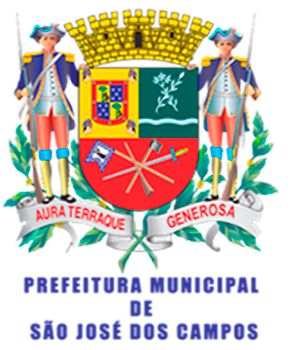{width="23%"}

    [https://www.sjc.sp.gov.br](https://www.sjc.sp.gov.br/){:target="_blank"}

    > :material-badge-account-horizontal-outline: Entrada: 04/2016 :fontawesome-regular-handshake: Saída: 11/2016

    **Segmento da Empresa:** Administração Pública

    **Cargo:** Estagiário

    **Departamento:** Tecnologia da Informação

    **Modalidade:** Estágio

    **Atribuições:** 
Atuante no acompanhamento de todo o funcionamento da rede interna e do servidor *Windows Server (Active Directory)* da repartição pública, criando usuários e definindo permissões aos mesmos, bem como o acompanhamento e análise das bordas nos sistemas relacionada à segurança da informação, além de deter experiência com cabeamento estruturado *(EIA/TIA)* e funções específicas ao suporte técnico remoto e presencial, no que tange à instalação e à configuração de *softwares* em geral como *Office 365*, *troubleshooting* dos sistemas SIPEX e GED, bem como configurações em gerais de *hardwares* e dispositivos de redes, realizando manutenções de periféricos e formatações em geral (Impressoras; *Desktops*; *Laptops* e demais dispositivos de *hardware*).

    **Competências técnicas/comportamentais desenvolvidas:**

    * *Windows Server (Active Directory);*
    * *Linux (FreeBSD);*
    * Cabeamento estruturado *(EIA/TIA);*
    * *Office 365;*
    * SIPEX;
    * GED;
    * Suporte técnico;
    * Manutenção de periféricos e hardware;
    * Relacionamento interpessoal;
    * Comunicação verbal e escrita;
    * Equilíbrio emocional;
    * Trabalho em equipe;
    * Resiliência.
    ---
    * **Declaração de Estágio Supervisionado - GP-Unidade de Gerenciamento do Programa-BID**

        [:fontawesome-regular-file-pdf: Download](documentos/pdf/ESTAGIARIO-TI-PMSJC.pdf){:download="ESTAGIARIO-TI-PMSJC.pdf"} para análise e apreciação.

??? Success " :material-town-hall: PMSJC"
    {width="23%"}

    [https://www.sjc.sp.gov.br](https://www.sjc.sp.gov.br/){:target="_blank"}

    > :material-badge-account-horizontal-outline: Entrada: 12/2014 :fontawesome-regular-handshake: Saída: 03/2015

    **Segmento da Empresa:** Administração Pública

    **Cargo:** Estagiário

    **Departamento:** Protocolo

    **Modalidade:** Estágio

    **Atribuições:** 
Atuante no departamento de protocolo e processos com escopo específico no atendimento ao munícipe e ao público em geral; Cópia e extração de documentos diversos; Análise e tramitação de documentos de inteiro teor; Envio e recebimento de correspondências; Envio e recebimento de *e-mails* diversos; Análise e elaboração de memorandos diversos; Acesso irrestrito a documentações públicas, contratos, licitações, plantas e documentos de particulares em formato digital; Acesso e domínio administrativo relacionado ao sistema informatizado SIPEX.

    **Competências técnicas/comportamentais desenvolvidas:**

    * SIPEX;
    * GED;
    * Documentação administrativa;
    * Relacionamento interpessoal;
    * Comunicação verbal e escrita;
    * Equilíbrio emocional;
    * Trabalho em equipe;
    * Resiliência.
    ---
    * **Declaração de Estágio Supervisionado - SGAF-DSI-DPA-Supervisão de Protocolo**

        [:fontawesome-regular-file-pdf: Download](documentos/pdf/ESTAGIARIO-ADMINISTRATIVO-PMSJC.pdf){:download="ESTAGIARIO-ADMINISTRATIVO-PMSJC.pdf"} para análise e apreciação.

??? Success ":fontawesome-solid-industry: General Motors"
    {width="27%"}

    [https://www.gm.com](https://www.gm.com/){:target="_blank"}

    > :material-badge-account-horizontal-outline: Entrada: 06/2004 :fontawesome-regular-handshake: Saída: 12/2013

    **Segmento da Empresa:** Indústria Automobilística

    **Cargos:**

    * Programador e Operador de Centro de Usinagem CNC (6 anos);
    * Preparador de Pintura/Coordenador de Times (1 ano e 6 meses);
    * Operador de Utilidades ETA/ETE (2 anos).

    **Departamentos:**

    * Powertrain (Usinagem);
    * Injetora de Plásticos (Injetoras/Pintura/Ferramentaria);
    * Utilidades (Casas de Bombas/ETA-ETE/Complexo SJC-SP).

    **Modalidade:** CLT

    **Atribuições:**

    

    <strong>6 anos:</strong> Atuante no cargo e função de <strong> Programador e Operador de Centro de Usinagem CNC</strong>  na planta powertrain, na área de motores e transmissões, contemplando atuação diária na inspeção visual e dimensional de girabrequins, carcaças e eixos-comando, com ampla participação na elaboração e planejamento de documentações técnicas, no que tange aos processos industriais de usinagem e montagem nas áreas de válvulas, eixos-comando, carcaça e girabrequim;
    

    

    <strong>1 ano e 6 meses:</strong> Atuante no cargo e função de <strong> Coordenador</strong>, com escopo de "Facilitador de Times" na planta de injetoras de plásticos e componentes, nas áreas de injetoras e pintura, com ênfase em segurança, no comprometimento e desenvolvimento das pessoas, na padronização de processos, na qualidade total de produtos e equipamentos, nos desperdícios de insumos e maquinários, no compromisso de todos com o meio ambiente, principalmente na melhoria contínua de tudo que engloba a planta e os procedimentos fabris, contemplando ainda atuação em atividades extracurriculares na área/departamento de ferramentaria, atuando como <strong> Ferramenteiro</strong>  com ênfase em inspeção, realizando e desenvolvendo trabalhos de manutenções corretivas e preventivas em moldes termodinâmicos de injeção plástica de para-choques (S-10, Blazer e veículos populares);
    

    

    <strong>2 anos:</strong> Atuante no cargo e função de <strong>Operador de Utilidades e Caldeiras</strong> em todo o complexo de São José dos Campos/SP,  na área de operação e manutenção de utilidades, com experiência em gerenciamento de consumo (gases GNV e GLP, vapor, ar comprimido, água desmineralizada, água potável, água gelada, condensados, óleo e combustíveis) fazendo o uso de manobras em gerais em casas de forças/caldeiras, casas de bombas, poços artesianos e operação em geral de bombas, torres de resfriamento, compressores de ar dos tipos parafusos e centrífugos (5.200 <em>cfm</em>), compressores <em>chiller's</em> e máquinas de absorção, trocadores de calor, desaeradores, máquinas e equipamentos de utilidades em geral, bem como experiência e vivenciamento em estações de tratamento de água e efluentes em geral (ETA/ETE) com participação direta e efetiva na operação de todo o processo de tratamento de efluentes industriais, domésticos e oleosos, contemplando ainda ampla atuação em manutenções preventivas e corretivas de bombas centrífugas, máquinas e sistemas (linhas) de utilidades fazendo o uso frequente de filosofias e ferramentas da qualidade como: <em>Lean Manufacturing, TPM, 5W2H, KAIZEN, TOC</em> (máquinas e linhas gargalos), <em>6S, FiFo, Justin Time, SWE,</em> etc.
    

    **Competências técnicas/comportamentais desenvolvidas:**

    * _GMS (Global Manufacturing System_);
    * Programação CAD/CAM;
    * Processos de Usinagem (Elaboração de documentação técnica);
    * Segurança do trabalho;
    * NR-35 (Trabalho em Alturas);
    * NR-13 (Segurança nas Operações de Caldeiras e Vasos de Pressão)
    * Relacionamento interpessoal;
    * Comunicação verbal e escrita;
    * Equilíbrio emocional;
    * Trabalho em equipe;
    * Resiliência;
    * Criatividade;
    * Liderança e coordenação.
    ---
    * **Profissiografia / Descrição das Atividades Laborais**

        [:fontawesome-regular-file-pdf: Download](documentos/pdf/PPP-GM.pdf){:download="PPP-GM.pdf"} para análise e apreciação.
    ---
    * **Declaração S.A. Liderança Injetoras - GM-SJC / Descrição das Atividades Laborais**

        [:fontawesome-regular-file-pdf: Download](documentos/pdf/EXPERIENCIA-LIDERANCA-INJETORAS-GM.pdf){:download="EXPERIENCIA-LIDERANCA-INJETORAS-GM.pdf"} para análise e apreciação.

??? Success ":material-airplane: Magroup Magnaghi Aerospace"
    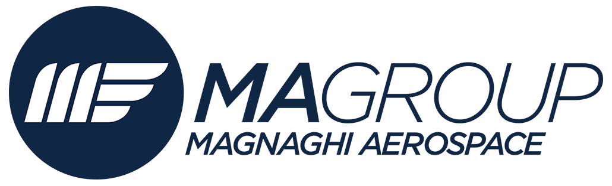{width="35%"}

    [https://www.magroup.net](https://www.magroup.net/magnaghi-do-brasil/){:target="_blank"}

    > :material-badge-account-horizontal-outline: Entrada: 06/2003 :fontawesome-regular-handshake: Saída: 06/2004

    **Segmento da Empresa:** Aeroespacial

    **Cargos:**

    * Ajustador Mecânico III;
    * Líder/Encarregado de Produção.

    **Departamentos:**

    * Ajustagem Mecânica;
    * Usinagem;
    * Inspeção.

    **Modalidade:** CLT

    **Atribuições:** 
Atuante com o cargo de **Ajustador Mecânico III**, com função específica e interina de **Líder/Encarregado de Produção**, com ênfase em gestão/coordenação de pessoas e de todos os processos fabris de usinagem, ajustes, acabamento e inspeções, realizando o acompanhamento de todas as etapas da produção de peças do segmento aeronáutico com priorização na inspeção do acabamento e ajustes atrelados ao **padrão Embraer**, fazendo o uso irrestrito de instrumentos tridimensionais de medição, acompanhado de leitura e interpretação de desenhos técnicos, sempre com o escopo no atendimento e superação da satisfação do cliente, linkando valores e metas na "Qualidade Total do Produto" estipulados e delegados pela direção e liderança da empresa.

    **Competências técnicas/comportamentais desenvolvidas:**

    * Usinagem CNC e convencional;
    * Ajustes e acabamento;
    * Inspeção técnica e tridimensional;
    * Relacionamento interpessoal;
    * Comunicação verbal e escrita;
    * Equilíbrio emocional;
    * Trabalho em equipe;
    * Resiliência;
    * Criatividade;
    * Liderança e coordenação.
    ---
    * **Profissiografia / Descrição das Atividades Laborais**

        [:fontawesome-regular-file-pdf: Download](documentos/pdf/PPP-AJUSTADOR-MECANICO.pdf){:download="PPP-AJUSTADOR-MECANICO.pdf"} para análise e apreciação.

??? Success ":fontawesome-solid-industry: PFF Inova"
    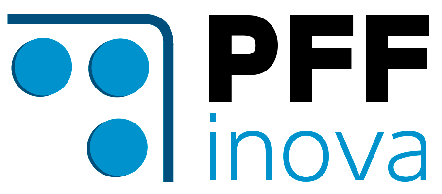{width="33%"}

    [https://pffinova.com.br](https://pffinova.com.br/){:target="_blank"}

    > :material-badge-account-horizontal-outline: Entrada: 09/2001 :fontawesome-regular-handshake: Saída: 05/2003

    **Segmento da Empresa:** Engenharia e Automação

    **Cargo:** Ajustador Ferramenteiro

    **Departamento:** Ferramentaria e Usinagem

    **Modalidade:** CLT

    **Atribuições:** 
Atuante com o cargo e função de **Ajustador Ferramenteiro**, contemplando funções e experiência em ferramentaria e ajustagem de bancada (confecção de ferramental em geral), leitura e interpretação de desenhos técnicos diversos, uso e manejo de instrumentos precisos de medições, bem como experiência vivenciada em eletro-erosão CNC a fio (Actspark) e á penetração (Engemaq), retíficas plana e cilíndrica, fresadoras CN e universais, furadeiras sensitivas e de coluna, afiação de ferramentas operacionais, ajustes e acabamentos em conjuntos de ferramentais, em específico às ferramentas de formação, selagem, corte, punções e matrizes, sendo todo este tipo de ferramental direcionados ao cliente e setor segmentado farmacêutico (laboratórios), em específico e atrelados á confecção e produção seriada do blister flex, havendo também uma ampla atuação na função de **Assistente Técnico** junto á vários clientes da indústria farmacêutica, sendo estes alocados no Brasil e no México.

    **Competências técnicas/comportamentais desenvolvidas:**

    * Usinagem CNC e convencional;
    * Ajustes e acabamento fino em bancada;
    * Inspeção técnica;
    * Relacionamento interpessoal;
    * Comunicação verbal e escrita;
    * Equilíbrio emocional;
    * Trabalho em equipe;
    * Resiliência;
    * Criatividade.
    ---
    * **Profissiografia / Descrição das Atividades Laborais**

        [:fontawesome-regular-file-pdf: Download](documentos/pdf/PPP-AJUSTADOR-FERRAMENTEIRO.pdf){:download="PPP-AJUSTADOR-FERRAMENTEIRO.pdf"} para análise e apreciação.

??? Success ":fontawesome-solid-industry: Ferrusmol Ferramentaria e Usinagem"
    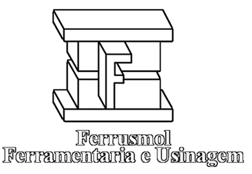{width="33%"}

    [https://ferrusmol.com.br](https://ferrusmol.com.br/){:target="_blank"}

    > :material-badge-account-horizontal-outline: Entrada: 10/2000 :fontawesome-regular-handshake: Saída: 05/2001

    **Segmento da Empresa:** Metalurgia e Usinagem de Precisão

    **Cargo:** Operador de Torno Automático

    **Departamento:** Ferramentaria e Usinagem

    **Modalidade:** CLT

    **Atribuições:** 
Atuante com o cargo e função de **Operador de Torno Automático**, com experiência em preparações de máquinas e ferramentas, atreladas juntamente com o acompanhamento e aferições da usinagem na confecção de peças seriadas, estas  direcionadas ao setor industrial de telefonia fixa e celulares.

    **Competências técnicas/comportamentais desenvolvidas:**

    * Usinagem convencional;
    * Preparação de máquinas e ferramentas;
    * Inspeção técnica e visual;
    * Relacionamento interpessoal;
    * Comunicação verbal e escrita;
    * Equilíbrio emocional;
    * Trabalho em equipe;
    * Resiliência;
    * Criatividade.
    ---
    * **Profissiografia / Descrição das Atividades Laborais**

        [:fontawesome-regular-file-pdf: Download](documentos/pdf/PPP-TORNEIRO-MECANICO.pdf){:download="PPP-TORNEIRO-MECANICO.pdf"} para análise e apreciação.

??? Success ":material-airplane: ITA/CTA"
    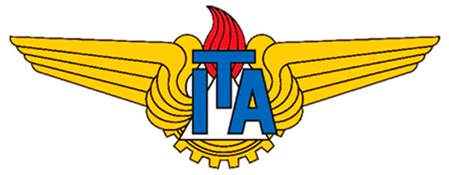{width="33%"}

    [http://www.ita.br](http://www.ita.br/){:target="_blank"}

    > :material-badge-account-horizontal-outline: Entrada: 04/1999 :fontawesome-regular-handshake: Saída: 09/2000

    **Segmento da Empresa:** Ciência e Tecnologia Aeroespacial

    **Cargo:** Estagiário/Instrutor

    **Departamento:** Laboratório Mecânico

    **Modalidade:** Estágio

    **Atribuições:** 
Atuação com o cargo e função de **Estagiário de Suporte**, com função interina de **Instrutor e de Suporte de Ensino** em laboratório mecânico da disciplina de "laboratório" aos alunos de 2º ano de engenharia mecânica do ITA-CTA (Divisão de Engenharia Mecânica - Aeronáutica), realizando e transmitindo conhecimentos específicos e tecnológicos de como proceder ao manusear máquinas operatrizes, ferramentas manuais, leitura e interpretação de desenhos técnicos juntamente com aferições em peças com instrumentos de medições de extrema precisão.

    **Competências técnicas/comportamentais desenvolvidas:**

    * Domínio técnico-operacional-pedagógico;
    * Usinagem convencional;
    * Preparação de máquinas e ferramentas;
    * Inspeção técnica e visual;
    * Relacionamento interpessoal;
    * Comunicação verbal e escrita;
    * Equilíbrio emocional;
    * Trabalho em equipe;
    * Resiliência;
    * Criatividade.
    ---
    * **Atestado/Declaração de Estágio Supervisionado - Pesquisador - ITA/CTA**

        [:fontawesome-regular-file-pdf: Download](documentos/pdf/ESTAGIARIO-ITA-CTA.pdf){:download="ESTAGIARIO-ITA-CTA.pdf"} para análise e apreciação.

??? Success ":simple-homeassistantcommunitystore: Fundhas "
    {width="33%"}

    [https://fundhas.org.br](https://fundhas.org.br/){:target="_blank"}

    > :material-badge-account-horizontal-outline: Entrada: 07/1996 :fontawesome-regular-handshake: Saída: 05/2000

    **Segmento da Empresa:** Assistência Social e Educação Pública

    **Cargo:** Auxiliar Administrativo

    **Departamento:** Administrativo (RH/Departamento Pessoal)

    **Modalidade:** CLT

    **Atribuições:** 
Atuação com o cargo de **Auxiliar Administrativo**, com em experiência empírica em: Tratação de documentações diversos; Preenchimento de documentações eletrônicas em ambiente MS Office; Preparação e análise de contratos diversos, bem como relatórios, memorandos internos e planilhas eletrônicas em ambiente MS Office; Análise e acompanhamento de processos administrativos via sistema interno; Atendimento de clientes e/ou fornecedores; Execução de rotinas diárias e apoio em Recursos Humanos com ênfase em recrutamento, seleção, treinamento e desenvolvimento; Execução de rotinas diárias e apoio em Departamento Pessoal com a utilização de sistemas interno e externo, com ênfase em admissão, demissão, férias e benefícios legais amparados à legislação trabalhista e convenção coletiva de categoria vigente à época; Prestação de atendimento e apoio em demandas logísticas.

    **Competências técnicas/comportamentais desenvolvidas:**

    * Rotinas administrativas correlatas;
    * Atendimentos a clientes internos e externos;
    * Relacionamento interpessoal;
    * Comunicação verbal e escrita;
    * Equilíbrio emocional;
    * Trabalho em equipe;
    * Resiliência;
    * Criatividade.
    ---
    * **Profissiografia / Descrição das Atividades Laborais**

        [:fontawesome-regular-file-pdf: Download](documentos/pdf/PPP-AUXILIAR-ADMINISTRATIVO.pdf){:download="PPP-AUXILIAR-ADMINISTRATIVO.pdf"} para análise e apreciação.

<!-- Ícone Whatsapp. -->
<!DOCTYPE html>
<html lang="pt-br">
<head>
    <meta charset="UTF-8">
    <meta name="viewport" content="width=device-width, initial-scale=1.0">
    
</head>
<body>
    <!-- Ícone do WhatsApp como imagem PNG -->
    

    
</body>
</html>