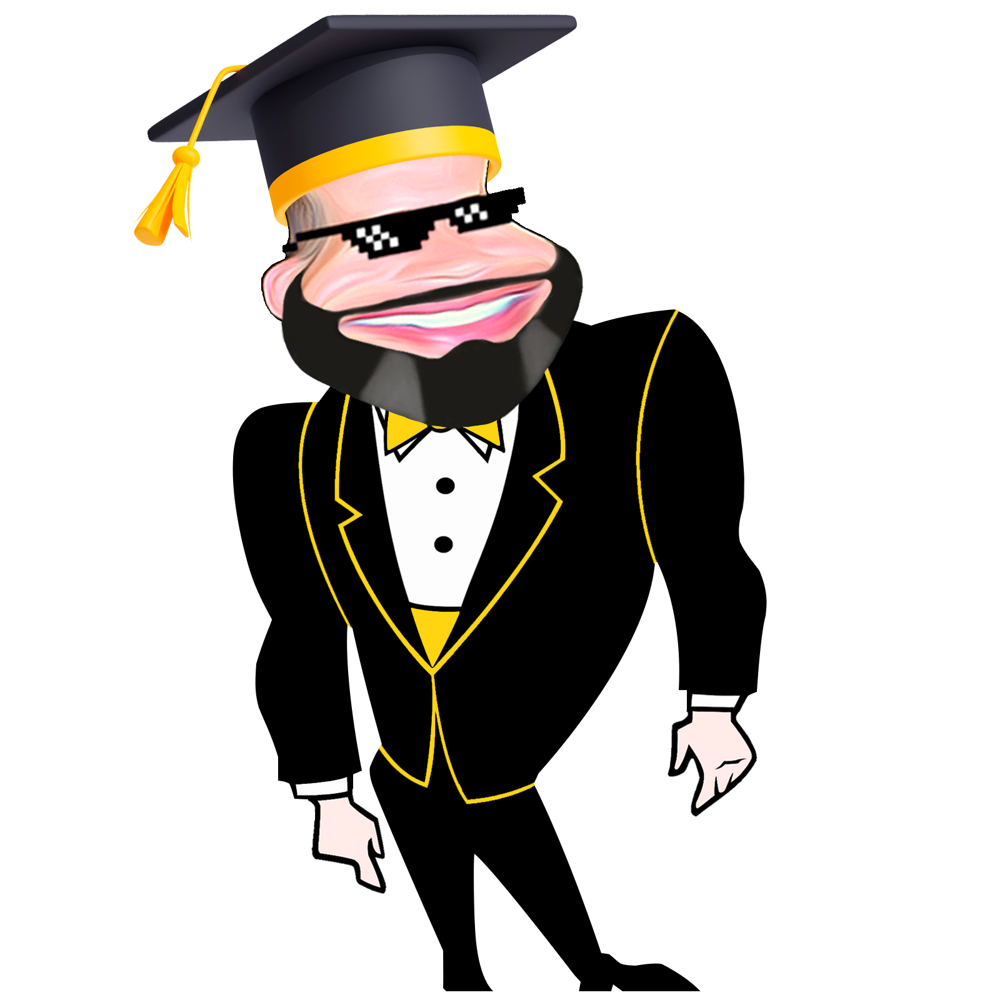
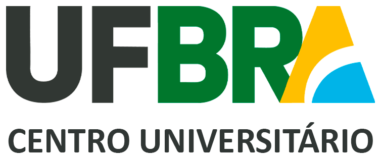

# **Alessandro Roberto dos Reis Santos**

<!DOCTYPE html><html lang="pt-BR"><head><meta charset="UTF-8"><meta name="viewport" content="width=device-width, initial-scale=1.0"></head><body>

</body></html>

## **Introdução**

Curso superior e todos os cursos técnicos destacados abaixo, estes cursados ao longo de minha carreira profissional, detém em cada um deles um PDF que são os respectivos diploma e certificados de conclusão para a realização do download e posteriores análises e apreciação.

## **Cursos Superiores**

??? Success ":fontawesome-solid-user-graduate: Administração de Empresas"
    > :material-book-education-outline: Início: 01/2013 :fontawesome-solid-flag-checkered: Conclusão: 02/2019

    {width="30%"}{width="15%"}

    [https://etep.edu.br](https://etep.edu.br/){:target="_blank"}

    **Diploma de curso superior:** [:fontawesome-regular-file-pdf: Download](documentos/pdf/DIPLOMA-GRADUACAO-ARRS.pdf){:download="DIPLOMA-GRADUACAO-ARRS.pdf"}

    ---
    
**Curso superior presencial (Bacharel) - Duração: 4 anos**

    
Formado em **Administração de Empresas** pelo Centro Universitário ETEP com sólidos conhecimentos vivenciados em ambiente acadêmico relacionados às competências:

    *  Administração e Gerenciamento de Operações e Processos;
    *  Gestão e Gerenciamento de Projetos;
    *  Gestão e Liderança de Pessoas;
    *  Gestão de Qualidade (Melhoria Contínua);
    *  Gestão de Marketing (Estratégias, Comunicação e Mídias Sociais);
    *  Gestão de Logística (MRP/MRP2);
    *  Planejamento e Controle de Produção;
    *  Controle Estatístico de Processo;
    *  Métodos e Processos;
    *  Normas/Sistemas e Ferramentas de Qualidade/Processo;
    *  Lean Manufacturing (Manufatura e processos enxutos/2 M’S – 2 S’s – REI);
    *  Kaizen;
    *  TOC - Teoria das Restrições;
    *  Kanban;
    *  Justin Time;
    *  PDCA;
    *  FiFo;
    *  6S’s;
    *  TPM;
    *  5W2H;
    *  SWE;
    *  ABNT;
    *  FMEA;
    *  PPCP;
    *  ISO 9000 e ISO 14000 (Auditoria Interna);
    *  ME2 (monitoramento, avaliação e controle).
    ---
    
    
**Disciplinas / Carga Horária**

    |Disciplinas cursadas e concluídas|Carga horária|
    |---|:---:|
    |Administração da Produção e Materiais|200h|
    |Administração de Marketing|100h|
    |Administração de Serviços|50h|
    |Administração Estratégica|100h|
    |Administração Financeira|200h|
    |Ambiente Econômico Global|50h|
    |Análise de Mercado|50h|
    |Análise Organizacional|50h|
    |Cálculo Básico|50h|
    |Ciência Política|50h|
    |Comércio Internacional|50h|
    |Comportamento Organizacional|50h|
    |Comunicação Empresarial|50h|
    |Contabilidade Geral|100h|
    |Contabilidade Gerencial|50h|
    |Desenvolvimento de Carreiras|50h|
    |Direito e Legislação|50h|
    |Direito Trabalhista e Previdenciário|50h|
    |Econometria Básica|50h|
    |Estatística|100h|
    |Estratégias de Marketing|50h|
    |Ética, Responsabilidade Social e Lógica|50h|
    |Filosofia|50h|
    |Fundamentos da Macroeconomia|50h|
    |Gestão Ambiental e Responsabilidade Social|50h|
    |Gestão da Qualidade|50h|
    |Gestão de Projetos|50h|
    |Gestão Orçamentária e Controladoria|50h|
    |Globalização e Visão de Futuro|50h|
    |História do Vale do Paraíba|50h|
    |Inferência Estatística|50h|
    |Introdução à Administração|50h|
    |Introdução à Economia|50h|
    |Introdução à Matemática Financeira|50h|
    |Introdução ao Direito do Trabalho|50h|
    |Introdução às Ciências Sociais|50h|
    |Limites e Derivadas|50h|
    |Língua Estrangeira|100h|
    |Logística|50h|
    |Matemática Básica: Funções|50h|
    |Matemática Financeira: Amortização e Análise de Investimentos|50h|
    |Matemática Financeira: Análises|50h|
    |Matemática Financeira: Capitalização e Descontos|50h|
    |Métodos Quantitativos para Tomada de Decisão|50h|
    |Microeconomia|100h|
    |Novos Negócios|50h|
    |Organização, Sistemas e Métodos|50h|
    |Organizações e Processos Dinâmicos|50h|
    |Pesquisa Operacional|50h|
    |Prática de Recursos Humanos|100h|
    |Práticas Trabalhistas|50h|
    |Probabilidade e Estatística|100h|
    |Psicologia Aplicada à Gestão de Pessoas|100h|
    |Qualidade de Vida|50h|
    |Recrutamento e Seleção|50h|
    |Relações Interpessoais|50h|
    |Simulação de Negócios|50h|
    |Sistemas de Informação Gerencial|50h|
    |Sociologia|50h|
    |Teoria das Organizações|50h|
    |Teoria Geral da Administração|50h|
    |Tópicos Especiais em Administração|50h|
    |Trabalho de Conclusão de Curso|200h|
    |**Carga horária total**|**4.050h**|

    ---
    **Trabalho de Conclusão de Curso**

    Plano de Negócio da Empresa Innovare Movelaria

    [:fontawesome-regular-file-pdf: Download](documentos/pdf/TCC-ARRS-ADM.pdf){:download="TCC-ARRS-ADM.pdf"}

    ---
    
**Experiências Profissionais - Administrativo**

    

    * Experiência profissional relevante nº 1 :material-arrow-right-bold: [Clique aqui](experiencia-profissional.md) e saiba mais.
    * Experiência profissional relevante n° 2 :material-arrow-right-bold: [Clique aqui](experiencia-profissional.md) e saiba mais.

??? Success ":fontawesome-solid-user-graduate: Educação Física"
    > :material-book-education-outline: Início: 02/2025 :fontawesome-solid-flag-checkered: Conclusão: 02/2029

    {width="30%"}{width="15%"}

    [https://ufbra.com.br/](https://ufbra.com.br){:target="_blank"}

    **Declaração de matrícula de curso superior:** [:fontawesome-regular-file-pdf: Download](documentos/pdf/DECLARACAO-MATRICULA-UFBRA.pdf){:download="DECLARACAO-MATRICULA-EF.pdf"}

    ---
    
**Curso superior presencial (Bacharel) - Duração: 4 anos**

    
Cursando **Educação Física** pelo centro universitário UFBRA no Campus Centro/SJC detendo e vivenciando sólidos conhecimentos em ambiente acadêmico relacionados às competências:

    * Planejamento e Prescrição de Atividades Físicas para diferentes públicos e necessidades;
    * Avaliação Física e Funcional (antropometria, testes de aptidão);
    * Fisiologia do Exercício e Bioenergética;
    * Cinesiologia e Biomecânica (análise do movimento);
    * Gestão de Programas e Projetos Esportivos;
    * Gestão de Equipamentos e Instalações (controle, manutenção e segurança);
    * Organização de Eventos e Competições;
    * Primeiros Socorros e Socorro de Urgência;
    * Treinamento Desportivo (periodização e princípios do treinamento);
    * Análise de Desempenho e Performance (esportes, atividades aquáticas, lutas, etc.);
    * Adaptação de Atividades para Pessoas com Deficiência;
    * Teorias e Métodos de Aprendizagem Motora;
    * Psicologia do Desenvolvimento e do Esporte;
    * Comunicação e Relações Interpessoais;
    * Uso de Tecnologias no Esporte e na Saúde (wearables, softwares, etc.);
    * Legislação e Ética Profissional (CREF);
    * Pesquisa Científica (elaboração de projetos, análise de dados).
    ---
    
    
**Disciplinas / Carga Horária**

    |Disciplinas em curso e concluídas|Carga horária|
    |---|:---:|
    |Biologia Básica|Cursando|
    |Anatomia Básica|Cursando|
    |Socorros de Urgência|Cursando|
    |História, Sociologia e Antropologia da Educação Física e Esporte|80h|
    |Metodologia da Pesquisa Científica|Cursando|
    |Arte, Cultura e Educação|Cursando|
    |Projeto Multidisciplinar Final I - Educação Física Bacharelado|Cursando|
    |Psicologia do Desenvolvimento e do Esporte|Cursando|
    |Anatomia Aplicada ao Exercício|Cursando|
    |Fisiologia Básica|Cursando|
    |Controle e Aprendizagem Motora|Cursando|
    |Comunicação e Expressão|Cursando|
    |ECA - Estatuto da Criança e do Adolescente|Cursando|
    |Estudos Socioantropológicos|Cursando|
    |Gestão de Conflitos|Cursando|
    |Gestão de Projetos|Cursando|
    |Gestão de Riscos Trabalhistas|Cursando|
    |Gestão do Conhecimento|Cursando|
    |Língua Brasileira de Sinais - Libras|Cursando|
    |Projeto Multidisciplinar II - Educação Física Bacharelado|Cursando|
    |Fisiologia do Exercício|Cursando|
    |Cinesiologia e Biomecânica|Cursando|
    |Crescimento e Desenvolvimento|Cursando|
    |Epidemiologia e Bioestatística|Cursando|
    |Gestão Financeira Básica|Cursando|
    |História e Cultura Afro-Brasileira e Indígena|Cursando|
    |Inovação e Tecnologia|Cursando|
    |Língua Brasileira de Sinais - Libras|Cursando|
    |Manifestações Rítmicas Expressivas|Cursando|
    |Noções de Direito|Cursando|
    |Projeto Multidisciplinar III - Educação Física Bacharelado|Cursando|
    |Saúde e Qualidade de Vida|Cursando|
    |Temas Sociais Abrangentes|Cursando|
    |Manifestações Esportivas e Alternativas|Cursando|
    |Treinamento Desportivo: Conceitos|Cursando|
    |Avaliação Física e Motora|Cursando|
    |Deficiências: Física e Mental|Cursando|
    |Atividades Físicas para Crianças e Adolescentes|Cursando|
    |Estágio Supervisionado - Educação Física Bacharelado|Cursando|
    |Projeto Multidisciplinar IV - Educação Física Bacharelado|Cursando|
    |Atividades Físicas para Jovens e Adultos|Cursando|
    |Atividade Física para Grupos Especiais|Cursando|
    |Educação em Espaços Não Escolares|Cursando|
    |Recreação e Lazer|Cursando|
    |Esportes Individuais|Cursando|
    |Estágio Supervisionado - Educação Física Bacharelado|Cursando|
    |Projeto Multidisciplinar V - Educação Física Bacharelado|Cursando|
    |Esportes Coletivos Tradicionais|Cursando|
    |Treinamento Desportivo: Aplicação|Cursando|
    |Futebol|Cursando|
    |Legislação e Políticas Públicas em Educação Física e Esporte|Cursando|
    |Atividades Extensionistas|Cursando|
    |Estágio Supervisionado - Educação Física Bacharelado|Cursando|
    |Ginásticas|Cursando|
    |Projeto Multidisciplinar Final I - Educação Física Bacharelado|Cursando|
    |Atividades de Academia|Cursando|
    |Musculação|Cursando|
    |Esportes de Rebater|Cursando|
    |Exercício Físico e Doenças Crônico-Degenerativas|Cursando|
    |Atividades Extensionistas|Cursando|
    |Estágio Supervisionado - Educação Física Bacharelado|Cursando|
    |Lutas|Cursando|
    |Projeto Multidisciplinar Final II - Educação Física Bacharelado|Cursando|
    |Atividades Aquáticas|Cursando|
    |Organização de Eventos Esportivos|Cursando|
    |Nutrição Aplicada à Atividade Física|Cursando|
    |Tecnologias no Esporte|Cursando|
    |Trabalho de Conclusão de Curso|-|
    |**Carga horária total**|-|

## **Cursos Técnicos**

??? Success ":fontawesome-solid-user-graduate: Redes de Computadores"
    > :material-book-education-outline: Início: 01/2018 :fontawesome-solid-flag-checkered: Conclusão: 12/2019

    {width="76%"}{width="15%"}

    [https://sp.senai.br/unidade/saojosedoscampos](https://sp.senai.br/unidade/saojosedoscampos/){:target="_blank"}

    **Certificado de curso técnico:** [:fontawesome-regular-file-pdf: Download](documentos/pdf/CERTIFICADO-TECNICO-TI.pdf){:download="CERTIFICADO-TECNICO-TI.pdf"}

    ---
    
**Curso técnico presencial - Duração: 2 anos**

    
Formado como **Técnico em Redes de Computadores** pela escola SENAI "Santos Dumont" com sólidos conhecimentos vivenciados em ambiente acadêmico relacionados às competências:

    * Servidores (_Windows Server AD;_ _Linux; NAS_ e _Firewall_ customizado);
    * _Virtual Machines_ (_Proxmox; Xenserver; VirtualBox; HyperV_);
    * _Help Desk_ (Criação de usuários; Permissões e monitoramentos);
    * Cabeamento estruturado com ênfase em infraestrutura (_ANSI_ e _EIA/TIA_);
    * Manutenções de periféricos (Impressoras; _Desktops_; _Notebooks_; Celulares);
    * Instalação e manutenções de sistemas CFTV;
    * Sistemas Operacionais (Formatações e instalações);
    * Pacote _Office 365 (Full)_;
    * Pacote _Adobe (Full)_;
    * _DevOps (Markdown - HTML - CSS - JS - Git_).
    ---
    
**Disciplinas / Carga Horária**

    |Disciplinas cursadas e concluídas|Carga horária|
    |---|:---:|
    |Administração de Dispositivos de Redes|75h|
    |Administração de Serviços de Gerenciamento e Segurança de Redes|75h|
    |Administraçao de Serviços de Redes Locais e Internet|75h|
    |Comunicação Oral e Escrita|75h|
    |Fundamentos de Infraestrutura de Redes|75h|
    |Fundamentos de Redes|75h|
    |Gestão de Pessoas|75h|
    |Instalação de Dispositivos de Redes|75h|
    |Instalação de Infraestrutura de Redes|75h|
    |Instalação de Serviços de Gerenciamento e Segurança em Redes|150h|
    |Instalação de Serviços de Redes Locais e Internet|150h|
    |Manutenção de Cabeamento Estruturado|75h|
    |Planejamento da Infraestrura de Redes|75h|
    |Projetos I|150h|
    |Projetos II|75h|
    |Sistemas Computacionais|150h|
    |**Carga horária total**|**1.500h**|

    ---
    **Trabalho de Conclusão de Curso**

    Implementação de um Ambiente Seguro em Redes de Compoutadores

    [:fontawesome-regular-file-pdf: Download](documentos/pdf/TCC-ARRS-TI.pdf){:download="TCC-ARRS-TI.pdf"}

    

    <iframe style="position: absolute; top: 0; left: 0; width: 100%; height: 100%;" src="https://www.youtube.com/embed/Lh4tBYPhngE?background=1?autoplay=1" title="Trabalho de Conclusão de Curso - SENAI" frameborder="0" allow="accelerometer; autoplay; clipboard-write; encrypted-media; gyroscope; picture-in-picture" allowfullscreen></iframe>
    

    ---
    **Experiências Profissionais - TI**

    

    * Experiência profissional relevante nº 1 :material-arrow-right-bold: [Clique aqui](experiencia-profissional.md) e saiba mais.
    * Experiência profissional relevante n° 2 :material-arrow-right-bold: [Clique aqui](experiencia-profissional.md) e saiba mais.

??? Success ":fontawesome-solid-user-graduate: Mecânica"
    > :material-book-education-outline: Início: 01/2000 :fontawesome-solid-flag-checkered: Conclusão: 12/2001

    {width="28%"}{width="15%"}

    [https://cephas.org.br](https://cephas.org.br/){:target="_blank"}

    **Certificado de curso técnico:** [:fontawesome-regular-file-pdf: Download](documentos/pdf/CERTIFICADO-TECNICO-MEC.pdf){:download="CERTIFICADO-TECNICO-MEC.pdf"}

    ---
    
**Curso técnico presencial - Duração: 2 anos**

    
Formado como **Técnico em Mecânica** pela escola CEPHAS - Colégio de Educação Profissional "Hélio Augusto de Souza"  com sólidos conhecimentos vivenciados em ambiente acadêmico relacionados às competências:

    * Planejamento e Controle de Produção;
    * Métodos e Processos;
    * Metalografia (Cálculos e ensaios estruturais);
    * Automação (Eletro hidráulica, eletropneumática e PLC);
    * CNC (Programação via CAD-CAM);
    * AutoCAD;
    * Normas/Sistemas e Ferramentas de Qualidade/Processo;
    * Lean Manufaturing (Manufatura e processos enxutos/2 M’S – 2 S’s – REI);
    * Kaizen;
    * Kanban;
    * Justin Time;
    * PDCA;
    * FiFo;
    * 6S’s;
    * TPM;
    * 5W2H;
    * SWE;
    * ABNT;
    * FMEA;
    * ISO 9000 e ISO 14000;
    * ME2 (Monitoramento, avaliação e controle);
    * Metrologia (Utilização, manejo e  manutenção de instrumentos precisos de medição);
    * Leitura e interpretação de desenhos técnico em geral.
    ---
    
**Disciplinas / Carga Horária**

    |Disciplinas cursadas e concluídas|Carga horária|
    |---|:---:|
    |Atividades em Projeto|100h|
    |Automação|160h|
    |Controle da Qualidade|60h|
    |Desenho Assistido por Computador|60h|
    |Desenho Técnico|100h|
    |Elementos de Máquinas|100h|
    |Eletroeletrônica|60h|
    |Ensaios Tecnológicos|60h|
    |Estatística|40h|
    |Ética e Cidadania|40h|
    |Gestão e Qualidade|40h|
    |Higiene e Segurança no Trabalho|40h|
    |Informática|60h|
    |Leitura e Produção de Textos|40h|
    |Máquinas Hidráulicas e Térmicas|60h|
    |Mecânica Técnica|40h|
    |Organização Industrial|40h|
    |Processos Industriais|180h|
    |Resistência dos Materiais|60h|
    |Tecnologia e Meio Ambiente|40h|
    |Tecnologia Mecânica|120h|
    |**Carga horária total**|**1.600h**|

    ---
    **Experiências Profissionais - Industrial**

    

    * Experiência profissional relevante nº 1 :material-arrow-right-bold: [Clique aqui](experiencia-profissional.md) e saiba mais.
    * Experiência profissional relevante n° 2 :material-arrow-right-bold: [Clique aqui](experiencia-profissional.md) e saiba mais.
    * Experiência profissional relevante n° 3 :material-arrow-right-bold: [Clique aqui](experiencia-profissional.md) e saiba mais.

<!-- Ícone Whatsapp. -->
<!DOCTYPE html>
<html lang="pt-br">
<head>
    <meta charset="UTF-8">
    <meta name="viewport" content="width=device-width, initial-scale=1.0">
    
</head>
<body>
    <!-- Ícone do WhatsApp como imagem PNG -->
    

    
</body>
</html>