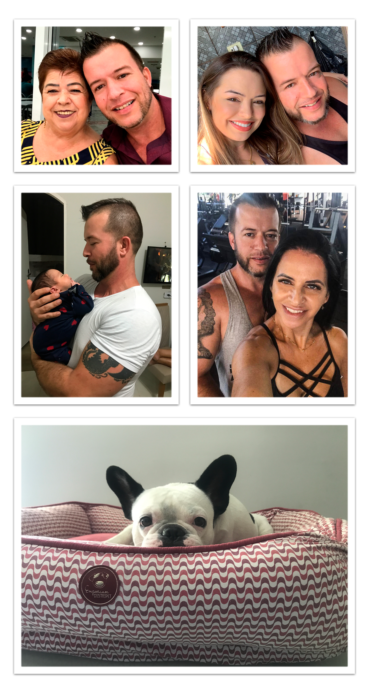

# **Alessandro Roberto dos Reis Santos**

<!DOCTYPE html><html lang="pt-BR"><head><meta charset="UTF-8"><meta name="viewport" content="width=device-width, initial-scale=1.0"><title>Exemplo de Imagem com Efeito de Órbita</title></head><body>

</body></html>

=== "Apresentação Pessoal :material-human-male-board:"
    
    
Olá, me chamo Alessandro Roberto, cristão, tenho 42 anos de idade, nascido, criado e residente em São José dos Campos/SP, morador da zona sul da cidade, filho único de uma mãe maravilhosa, divorciado, pai de duas filhas e avô de uma menina linda e abençoada.
 
    
Minha primogênita chama-se Daiane e tem 25 anos, com formação em Direito e atuante na área, além de já ser casada com um excelente esposo, os quais já me proporcionaram ser avô de uma neta linda chamada Jade e que já tem 1 e meio de idade.
 
    
Minha segunda filha que é a minha caçula de 6 aninhos, chama-se Lolla e ela tem 4 patinhas, uma buldoguinha francesa dócil, meiga e linda que todos os dias me traz muitas alegrias com a sua companhia.

    ??? tip ":fontawesome-solid-people-roof: A minha inspiração :fontawesome-solid-photo-film:"
        
**FAMÍLIA**

        {width="100%"}
        
=== "Apresentação Profissional :material-human-male-board:"

    
Bacharel em administração de empresas, técnico em redes de computadores e informática, técnico em mecânica industrial, profissional polivalente com amplo conhecimento e sólida experiência vivenciada em empresas e órgãos públicos governamentais, atuando em ambientes pedagógicos (docente de cursos técnicos em administração e logística), em departamentos administrativos e de tecnologia da informação , bem como detentor de experiências em indústrias dos ramos de processos de fabricação, em específico a departamentos de usinagem, ferramentaria, qualidade e geração de utilidades com ênfase na cadeia produtiva de empresas dos segmentos aeronáuticos, automotivos, farmacêuticos, médicos e de higiene pessoal da região metropolitana do Vale do Paraíba, em específico na cidade de São José dos Campos/SP.

    ??? tip ":fontawesome-solid-user-tie: Profissional Polivalente :fontawesome-solid-photo-film:"
        {width="100%" .left-image align=center}

=== "Vídeo Apresentação :octicons-video-16:"

     

    <iframe width="640" height="360" src="https://www.youtube.com/embed/kVET2zMUfes" title="Vídeo Apresentação - Alessandro" frameborder="0" allow="accelerometer; autoplay; clipboard-write; encrypted-media; gyroscope; picture-in-picture; web-share" allowfullscreen></iframe>
    

    !!! info "Observações"
        :material-video-vintage: Vídeo apresentação gravada na data do dia de **24/11/2023**

        ---

        **Currículo Profissional**

        [www.alessandroroberto.com.br](https://www.alessandroroberto.com.br/){:target="_blank"}
        
=== "Meu Futuro :material-rocket-launch-outline:"

    
Em minha vida pessoal almejo sim casar-me novamente com uma excelente mulher, deter muita saúde e disposição física, bem como deter condições financeiras de adquirir uma chácara em um local bacana para festas e confraternizações familiares e curtir muito a minha família.

    
    
Profissionalmente me projeto para daqui mais ou menos uns 6 anos, estar formado com a minha segunda graduação em Redes de Computadores juntamente com a minha pós-graduação em Segurança da Informação, estudar e aperfeiçoar-se em meu inglês e se Deus permitir, quem sabe estar atuando na área de TI em uma excelente empresa e continuar a aprender coisas novas e a estudar sempre, pois tudo que faço em minha vida, faço com muita paixão e afinco.

<!DOCTYPE html>
<html lang="pt-br">
<head>
    <meta charset="UTF-8">
    <meta name="viewport" content="width=device-width, initial-scale=1.0">
    <title>Ícone do WhatsApp</title>
    
</head>
<body>
    <!-- Ícone do WhatsApp como imagem PNG -->
    

    
</body>
</html>

