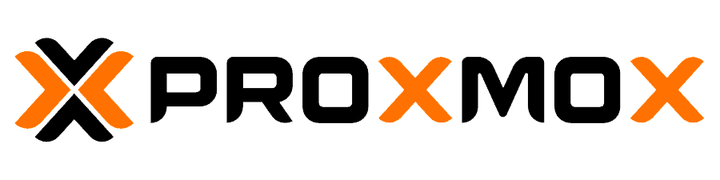
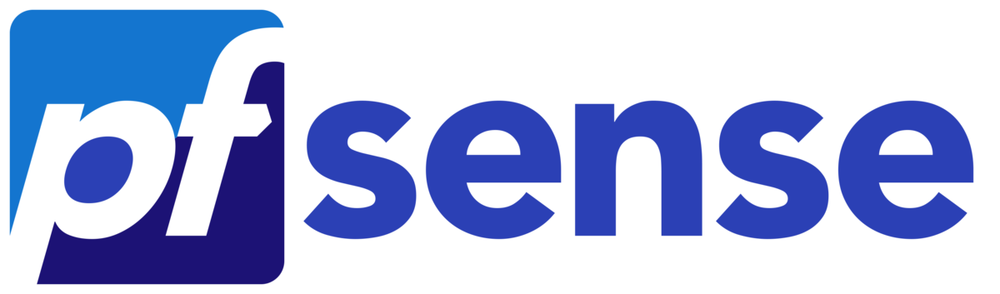
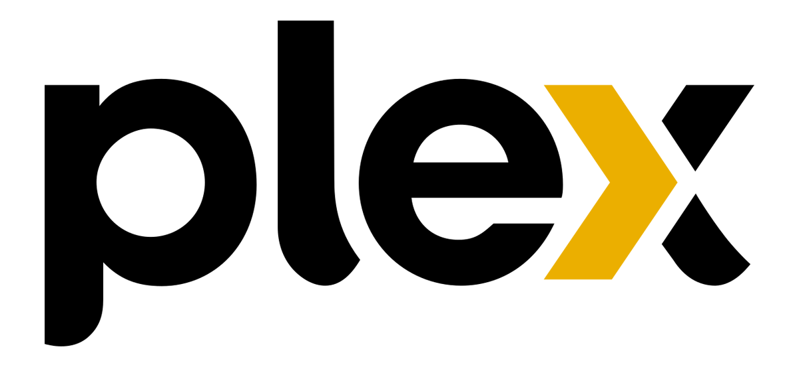

# **Alessandro Roberto dos Reis Santos**

<!DOCTYPE html><html lang="pt-BR"><head><meta charset="UTF-8"><meta name="viewport" content="width=device-width, initial-scale=1.0"><title>Exemplo de Imagem com Efeito de Órbita</title></head><body>

</body></html>

---

## **Introdução**

Projetos de infraestrutura desenvolvidos em ambientes acadêmico e doméstico (pós-curso).

---

## **Projetos de Infraestrutura**

??? note Example ":fontawesome-solid-network-wired: Implementação de um Ambiente Seguro em Redes de Compoutadores"
    **TCC:** [:simple-youtube: YouTube](https://youtu.be/Lh4tBYPhngE?list=PLD1Y6l4XaYY3Aj6yvVVlRGzEYZUEO981I){:target="_blank"}
    
    ---
    

    <iframe width="640" height="360" src="https://www.youtube.com/embed/Lh4tBYPhngE?list=PLD1Y6l4XaYY3Aj6yvVVlRGzEYZUEO981I" title="TRABALHO DE CONCLUSÃO DE CURSO" frameborder="0" allow="accelerometer; autoplay; clipboard-write; encrypted-media; gyroscope; picture-in-picture; web-share" allowfullscreen></iframe>
    

??? note Example ":fontawesome-solid-network-wired: Projeto de Planejamento de Infraestrutura"
    **Projeto:** [:simple-youtube: YouTube](https://youtu.be/ezZMislsSBY?list=PLD1Y6l4XaYY3Aj6yvVVlRGzEYZUEO981I){:target="_blank"}

    ---
    

    <iframe width="640" height="360" src="https://www.youtube.com/embed/ezZMislsSBY?list=PLD1Y6l4XaYY3Aj6yvVVlRGzEYZUEO981I" title="PROJETO DE PLANEJAMENTO DE INFRAESTRUTURA DE REDES" frameborder="0" allow="accelerometer; autoplay; clipboard-write; encrypted-media; gyroscope; picture-in-picture; web-share" allowfullscreen></iframe>
    

??? note Example ":fontawesome-solid-network-wired: Projeto Proxmox doméstico!"
    {width="28%"}

    ---
    * Projeto **_Proxmox_** já implementado!
    * Realização da documentação no formato [_MkDocs_](https://squidfunk.github.io/mkdocs-material/){:target="_blank"} no ambiente e site [_GitHub_](https://github.com/){:target="_blank"} (Em andamento).
    * Perfil :simple-github:: [arrs82](https://github.com/arrs82){:target="_blank"}
    * Perfil :fontawesome-brands-youtube:: [@aleha.santos](https://www.youtube.com/@aleha.santos){:target="_blank"}

??? note Example ":fontawesome-solid-network-wired: Projeto PfSense Firewall doméstico!"
    {width="20%"}

    ---
    * Projeto **_PfSense Firewall_** já implementado!
    * Realização da documentação no formato [_MkDocs Material Theme_](https://squidfunk.github.io/mkdocs-material/){:target="_blank"} no ambiente e site [_GitHub_](https://github.com/){:target="_blank"} (Em andamento).
    * Perfil :simple-github:: [arrs82](https://github.com/arrs82){:target="_blank"}
    * Perfil :fontawesome-brands-youtube:: [@aleha.santos](https://www.youtube.com/@aleha.santos){:target="_blank"}

??? note Example ":fontawesome-solid-network-wired: Projeto Streaming Pessoal doméstico!"
    {width="12%"}

    ---
    * Projeto **_Plex-Server_** já implementado!
    * Realização da documentação no formato [_MkDocs Material Theme_](https://squidfunk.github.io/mkdocs-material/){:target="_blank"} no ambiente e site [_GitHub_](https://github.com/){:target="_blank"} (Em andamento).
    * Perfil :simple-github:: [arrs82](https://github.com/arrs82){:target="_blank"}
    * Perfil :fontawesome-brands-youtube:: [@aleha.santos](https://www.youtube.com/@aleha.santos){:target="_blank"}