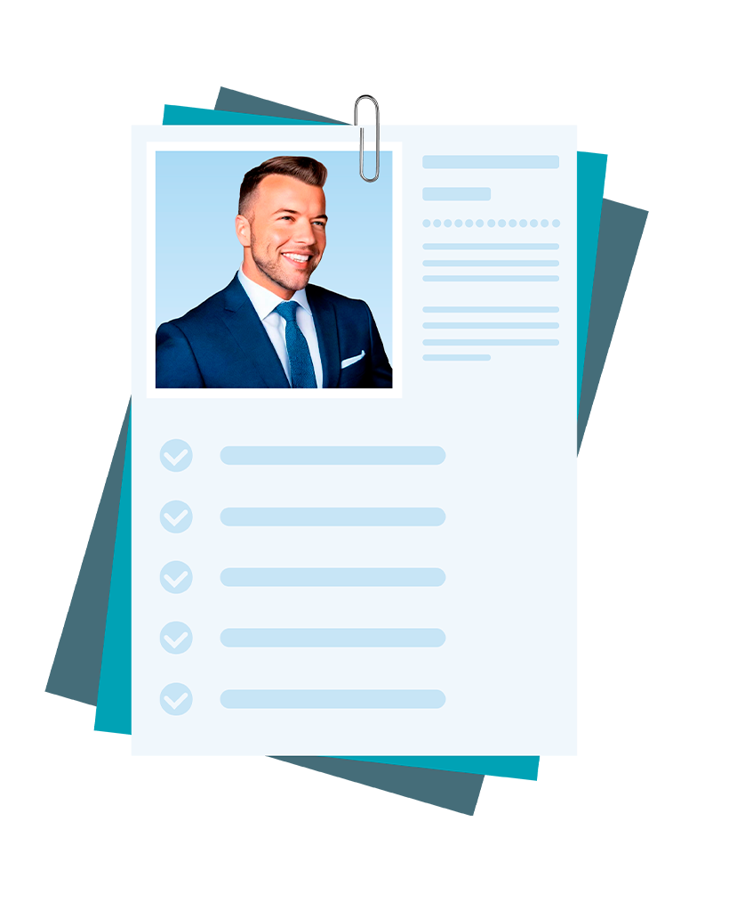

# **Alessandro Roberto dos Reis Santos**

<!DOCTYPE html><html lang="pt-BR"><head><meta charset="UTF-8"><meta name="viewport" content="width=device-width, initial-scale=1.0"><title>Exemplo de Imagem com Efeito de Órbita</title></head><body>

</body></html>

## **Introdução**

Seminários motivacionais com o palestrante <a href="https://alfredorocha.com.br/" target="_blank">Alfredo Rocha</a>, excelente profissional e um ser humano maravilhoso e simples, sendo este riquíssimo conteúdo meramente para cunho didático e apenas para conhecimentos aqui em meu currículo a quem interessar, com treinamentos difundidos para empresas e profissionais diversos, que inclusive já tive o prazer de estar pessoalmente em um desses seminários e com o próprio palestrante, pois o mesmo foi de grande valia para a minha vida pessoal, para o meu currículo e principalmente para a minha carreira profissional.

---
## **Seminários Motivacionais**
**Motivando Todos para a Missão**

<iframe style="position: absolute; top: 0; left: 0; width: 100%; height: 100%;" src="https://www.youtube.com/embed/O9LZGAn3DBk" title="MOTIVANDO TODOS PARA A MISSÃO" frameborder="0" allow="accelerometer; autoplay; clipboard-write; encrypted-media; gyroscope; picture-in-picture" allowfullscreen></iframe>

---
**Motivando Todos para as Mudanças**

<iframe style="position: absolute; top: 0; left: 0; width: 100%; height: 100%;" src="https://www.youtube.com/embed/36iOu9u-2Yo" title="MOTIVANDO TODOS PARA AS MUDANÇAS" frameborder="0" allow="accelerometer; autoplay; clipboard-write; encrypted-media; gyroscope; picture-in-picture" allowfullscreen></iframe>

---
**Motivando Todos para a Qualidade**

<iframe style="position: absolute; top: 0; left: 0; width: 100%; height: 100%;" src="https://www.youtube.com/embed/iZ755NZ3VLc" title="MOTIVANDO TODOS PARA A QUALIDADE" frameborder="0" allow="accelerometer; autoplay; clipboard-write; encrypted-media; gyroscope; picture-in-picture" allowfullscreen></iframe>

---
??? note Success ":octicons-mortar-board-16: Seminário ONDEC - Motivando Todos para os Novos Desafios"
    > :material-book-education-outline: Início: 05/2011 :fontawesome-solid-flag-checkered: Conclusão: 05/2011

    {width="27%"}

    [https://alfredorocha.com.br](https://alfredorocha.com.br/){:target="_blank"}

    **Certificado de seminário:** [:fontawesome-regular-file-pdf: Download](documentos/pdf/CERTIFICADO-MOTIVANDO-TODOS-PARA-OS-NOVOS-DESAFIOS.pdf){:download="CERTIFICADO-MOTIVANDO-TODOS-PARA-OS-NOVOS-DESAFIOS.pdf"}

    **Carga horária:** 2 horas e 15 minutos
  
    ---
    

    
    

        Seminário **"Motivando Todos para os Novos Desafios"** na cidade de São José dos Campos - SP na data do dia **28 de Maio de 2011**.
    

    

    
<!DOCTYPE html>
<html lang="pt-br">
<head>
    <meta charset="UTF-8">
    <meta name="viewport" content="width=device-width, initial-scale=1.0">
    <title>Ícone do WhatsApp</title>
    
</head>
<body>
    <!-- Ícone do WhatsApp como imagem PNG -->
    

    
</body>
</html>